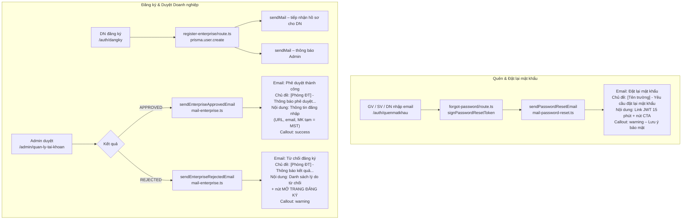
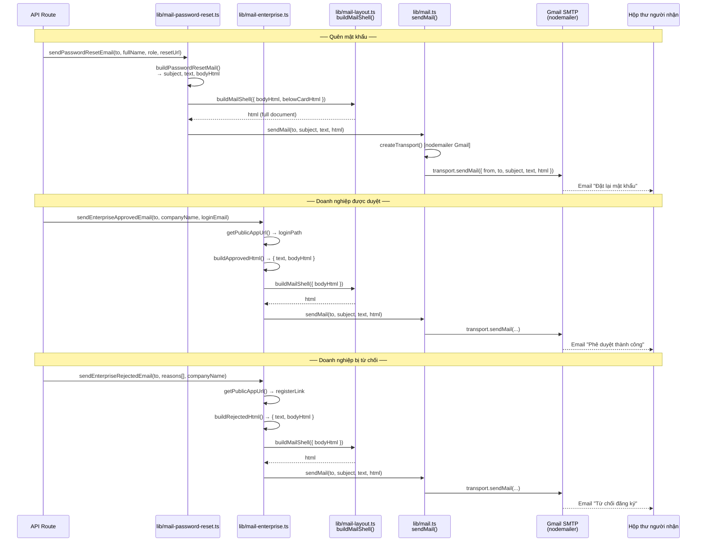
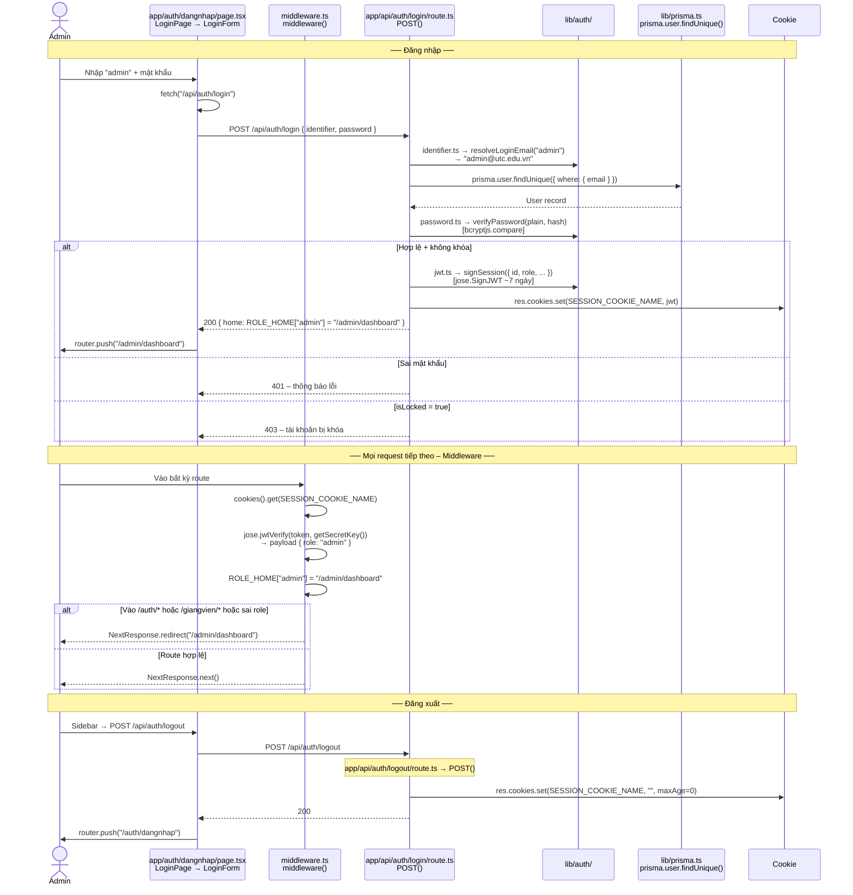
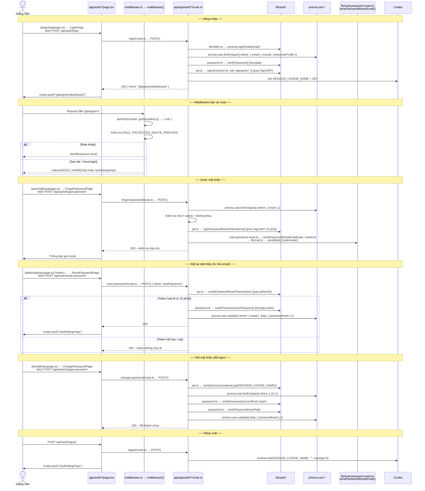
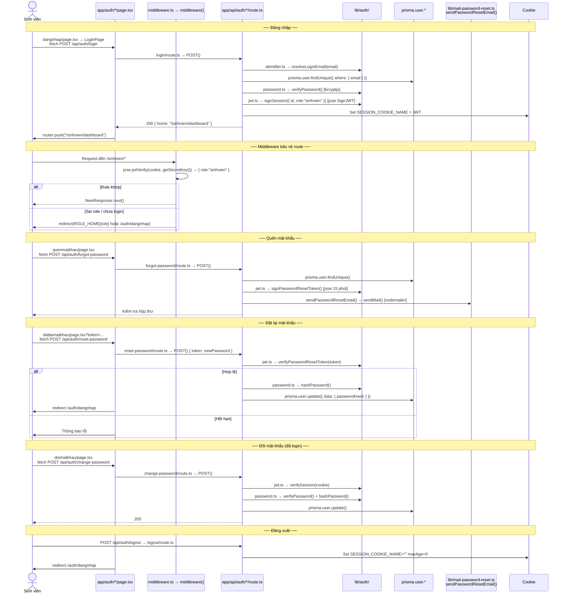
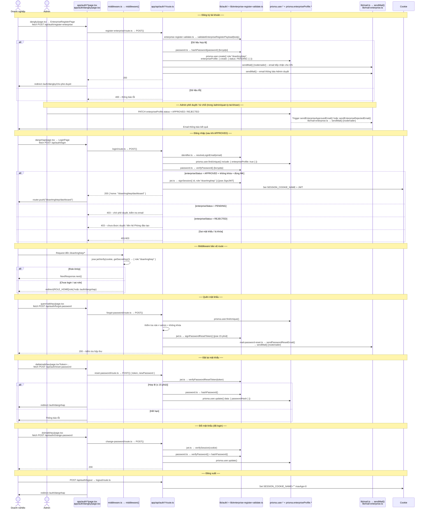

# Luồng xác thực (Auth)

---

## Bảng tổng quan

| Vai trò | Sau đăng nhập thành công | Quên & đặt lại MK | Đổi MK | Đăng ký |
|--------|--------------------------|--------------------|---------|---------| 
| **Admin** | `/admin/dashboard` | Không | Không | Không (seed/quản trị) |
| **Giảng viên** | `/giangvien/dashboard` | Có | Có | Không |
| **Sinh viên** | `/sinhvien/dashboard` | Có | Có | Không |
| **Doanh nghiệp** | `/doanhnghiep/dashboard` | Có (khi đã duyệt) | Có (khi đã duyệt) | Có — `/auth/dangky` → chờ phê duyệt |

Cookie phiên: `session` (JWT ~7 ngày).

---

## Tech Stack

### Thư viện & công nghệ cốt lõi

| Lớp | Thư viện / Module | Vai trò |
|-----|-------------------|---------|
| Framework | **Next.js 15** (App Router) | Route handlers, middleware, pages |
| ORM | **Prisma** (`@prisma/client`) | Truy vấn DB (PostgreSQL) |
| JWT | **`jose`** | Ký/verify token phiên (`signSession`, `verifySession`), token đặt lại MK (`signPasswordResetToken`, `verifyPasswordResetToken`) |
| Mã hoá mật khẩu | **`bcryptjs`** | `hashPassword`, `verifyPassword` |
| Email | **`nodemailer`** | Gửi mail qua SMTP (`sendMail` trong `lib/mail.ts`) |
| Cookie | Next.js `cookies()` / `response.cookies` | Lưu JWT phiên dưới tên `SESSION_COOKIE_NAME` |

### Cấu trúc thư mục auth

```
app/
├── api/auth/
│   ├── login/route.ts              # POST – đăng nhập
│   ├── logout/route.ts             # POST – đăng xuất
│   ├── me/route.ts                 # GET  – lấy thông tin phiên
│   ├── forgot-password/route.ts    # POST – gửi email đặt lại MK
│   ├── reset-password/route.ts     # POST – đặt lại MK bằng token
│   ├── change-password/route.ts    # POST – đổi MK khi đã login
│   └── register-enterprise/route.ts# POST – đăng ký tài khoản DN
│
├── auth/
│   ├── dangnhap/page.tsx           # UI đăng nhập
│   ├── quenmatkhau/page.tsx        # UI quên mật khẩu
│   ├── datlaimatkhau/page.tsx      # UI đặt lại mật khẩu
│   ├── doimatkhau/page.tsx         # UI đổi mật khẩu (cần phiên)
│   └── dangky/page.tsx             # UI đăng ký doanh nghiệp

lib/
├── auth/
│   ├── jwt.ts                      # signSession, verifySession, signPasswordResetToken, verifyPasswordResetToken, getSecretKey
│   ├── password.ts                 # hashPassword, verifyPassword (bcryptjs)
│   ├── identifier.ts               # resolveLoginEmail (map "admin" → email thật)
│   └── admin-session.ts            # getAdminSession (helper server-side)
├── mail.ts                         # sendMail (nodemailer)
├── mail-layout.ts                  # buildMailShell, escapeHtml, mailCalloutHtml
├── mail-password-reset.ts          # buildPasswordResetMail, sendPasswordResetEmail
├── mail-enterprise.ts              # sendEnterpriseApprovedEmail, sendEnterpriseRejectedEmail, getPublicAppUrl
├── prisma.ts                       # export prisma (PrismaClient singleton)
└── constants/
    ├── auth/patterns.ts            # SESSION_COOKIE_NAME, ...
    ├── auth/guards.ts              # AUTH_EXACT_ROUTES_REQUIRE_SESSION, ROLE_PROTECTED_ROUTE_PREFIXES
    └── routing.ts                  # ROLE_HOME (map role → home URL)

middleware.ts                       # Bảo vệ route, redirect theo role (dùng jose.jwtVerify trực tiếp)
```

### Luồng dữ liệu kỹ thuật chung

```
Cookie "session" (JWT)
  └── ký bởi   lib/auth/jwt.ts → signSession()          [jose.SignJWT]
  └── verify bởi lib/auth/jwt.ts → verifySession()      [jose.jwtVerify]
               middleware.ts → jwtVerify() trực tiếp    [jose.jwtVerify]

Token đặt lại MK (JWT 15 phút, qua email)
  └── ký bởi   lib/auth/jwt.ts → signPasswordResetToken()
  └── verify bởi lib/auth/jwt.ts → verifyPasswordResetToken()

Mật khẩu
  └── hash bởi  lib/auth/password.ts → hashPassword()   [bcryptjs.hash]
  └── check bởi lib/auth/password.ts → verifyPassword() [bcryptjs.compare]

Email
  └── lib/mail.ts → sendMail()                          [nodemailer + Gmail SMTP]
      ├── lib/mail-password-reset.ts → sendPasswordResetEmail()
      └── lib/mail-enterprise.ts → sendEnterpriseApprovedEmail/RejectedEmail()
```

---

## Email

### Cấu hình & hạ tầng

| Biến môi trường | Mô tả |
|----------------|-------|
| `EMAIL_FROM` | Địa chỉ Gmail dùng để gửi (cũng là `auth.user` của SMTP) |
| `EMAIL_PASSWORD` | App Password của Gmail (không phải mật khẩu đăng nhập Google) |
| `EMAIL_FROM_NAME` | Tên hiển thị người gửi, mặc định `"Hệ thống thực tập UTC"` |
| `APP_URL` | URL public của ứng dụng — dùng để tạo link trong email (`VERCEL_URL` là fallback) |
| `SUPPORT_EMAIL` | Email hỗ trợ hiển thị trong footer mail |
| `SCHOOL_HOTLINE` | Số điện thoại hotline hiển thị trong email |

**Transport:** `nodemailer.createTransport({ service: "gmail", auth: { user, pass } })` — tạo mới mỗi lần gọi `sendMail()`.

### Kiến trúc pipeline email

```
Caller (API route)
    │
    ├─ lib/mail-password-reset.ts
    │      buildPasswordResetMail(fullName, role, resetUrl)
    │        → subject, text (plain), html
    │      sendPasswordResetEmail(to, fullName, role, resetUrl)
    │        → gọi sendMail()
    │
    ├─ lib/mail-enterprise.ts
    │      sendEnterpriseApprovedEmail(to, companyName, loginEmail)
    │        buildApprovedHtml()  → { text, bodyHtml }
    │        buildMailShell({ bodyHtml }) → html hoàn chỉnh
    │        → gọi sendMail()
    │
    │      sendEnterpriseRejectedEmail(to, reasons[], companyName)
    │        buildRejectedHtml() → { text, bodyHtml }
    │        buildMailShell({ bodyHtml }) → html hoàn chỉnh
    │        → gọi sendMail()
    │
    └─ lib/mail.ts → sendMail(to, subject, text, htmlOverride?)
           createTransport()  [nodemailer Gmail SMTP]
           buildMailShell({ bodyHtml: fallback từ text })  ← nếu không có htmlOverride
           transport.sendMail({ from, to, subject, text, html })
```

### Cấu trúc HTML email (`lib/mail-layout.ts`)

Mọi email đều được bọc trong **`buildMailShell()`** — tạo ra 1 file HTML hoàn chỉnh gồm 3 vùng:

```
┌─────────────────────────────────────────────────────┐
│  HEADER  (buildHeader)                              │
│  · Nền xanh đậm #005bac                             │
│  · "Bộ Giáo dục và Đào tạo"                        │
│  · Tên trường (SCHOOL_FULL_NAME)                    │
│  · "Phòng Đào tạo · Hệ thống Quản lý Thực tập"    │
├─────────────────────────────────────────────────────┤
│  BODY  (bodyHtml — nội dung từng loại mail)         │
│  · Màu sắc theo MAIL_ACCENT (primary #005bac)       │
│  · Callout box: mailCalloutHtml(variant, title, html)│
│    variants: info / success / warning / danger      │
├─────────────────────────────────────────────────────┤
│  BELOW CARD  (belowCardHtml — tuỳ chọn)             │
│  · Link dự phòng nếu nút CTA không hoạt động        │
├─────────────────────────────────────────────────────┤
│  FOOTER  (buildFooter)                              │
│  · Nền tối #1f2937                                  │
│  · Địa chỉ, hotline, email hỗ trợ, website          │
│  · "Email gửi tự động — vui lòng không reply"       │
└─────────────────────────────────────────────────────┘
```

**Palette màu `MAIL_ACCENT`:**

| Key | Mã màu | Dùng cho |
|-----|--------|----------|
| `primary` | `#005bac` | Header, nút CTA, link |
| `primaryDark` | `#004a8a` | Viền trên header |
| `success` | `#027a48` | Callout duyệt thành công |
| `danger` | `#b42318` | Callout từ chối / cảnh báo đỏ |
| `warning` | `#92400e` | Callout cảnh báo vàng |
| `muted` | `#5b6470` | Text phụ, footer |
| `text` | `#1f2937` | Text chính |

### Danh sách email theo sự kiện



### Chi tiết từng loại email

#### 1. Đặt lại mật khẩu
- **File:** `lib/mail-password-reset.ts` → `sendPasswordResetEmail(to, fullName, role, resetUrl)`
- **Trigger:** `POST /api/auth/forgot-password` (role ≠ admin, tài khoản không khóa)
- **Người nhận:** GV / SV / DN — địa chỉ email tài khoản
- **Chủ đề:** `[Tên trường] - Yêu cầu đặt lại mật khẩu tài khoản`
- **Nội dung:**
  - Chào đích danh (`fullName`)
  - Xác nhận nhận yêu cầu đặt lại MK
  - Nút CTA **"ĐẶT LẠI MẬT KHẨU"** → `resetUrl` = `/auth/datlaimatkhau?email=...&token=...`
  - Callout `warning`: token hết hạn 15 phút, không chia sẻ link
  - Link dự phòng dạng text (belowCardHtml)
- **Token:** JWT signed bởi `signPasswordResetToken()`, expiry 15 phút

#### 2. Phê duyệt doanh nghiệp thành công
- **File:** `lib/mail-enterprise.ts` → `sendEnterpriseApprovedEmail(to, companyName, loginEmail)`
- **Trigger:** Admin cập nhật `enterpriseStatus = APPROVED` trong `/admin/quan-ly-tai-khoan`
- **Người nhận:** Email đăng ký của doanh nghiệp
- **Chủ đề:** `[Phòng Đào tạo – Tên trường] - Thông báo phê duyệt tài khoản kết nối thực tập thành công`
- **Nội dung:**
  - Thông báo hồ sơ đã được phê duyệt
  - Bảng thông tin đăng nhập: URL hệ thống, email đăng nhập, mật khẩu tạm = MST
  - Callout `success`: yêu cầu đổi MK ngay lần đầu đăng nhập
  - Thông tin liên hệ hỗ trợ (email + hotline)

#### 3. Từ chối đăng ký doanh nghiệp
- **File:** `lib/mail-enterprise.ts` → `sendEnterpriseRejectedEmail(to, reasons[], companyName)`
- **Trigger:** Admin cập nhật `enterpriseStatus = REJECTED`
- **Người nhận:** Email đăng ký của doanh nghiệp
- **Chủ đề:** `[Phòng Đào tạo – Tên trường] - Thông báo kết quả đăng ký tài khoản kết nối thực tập`
- **Nội dung:**
  - Thông báo hồ sơ chưa được phê duyệt
  - Danh sách lý do (`reasons[]`) dạng ordered list với callout `danger`
  - Callout `warning` + nút **"MỞ TRANG ĐĂNG KÝ"** → `/auth/dangky` để nộp lại
  - Hotline hỗ trợ

### Sơ đồ sequence gửi email



---

## 1. Admin

### Đặc điểm
- Tài khoản tạo bằng seed / quản trị DB — không có form đăng ký.
- Đăng nhập bằng `admin` hoặc `admin@utc.edu.vn` (hệ thống tự map).
- Không có luồng quên/đặt lại/đổi mật khẩu qua web.
- Link **"Quên mật khẩu?"** bị ẩn khi phát hiện email admin.

### Sơ đồ luồng



### Bảng thao tác

| Thao tác | Được phép? | Ghi chú |
|----------|------------|---------|
| Đăng nhập | Có | `admin` hoặc `admin@utc.edu.vn` |
| Đăng xuất | Có | `POST /api/auth/logout` |
| Quên / đặt lại MK | **Không** | `forgot-password` route.ts trả 403 cho admin |
| Đổi MK trên web | **Không** | `change-password` route.ts trả 403 cho admin |
| Đăng ký | **Không** | Không có flow công khai |

---

## 2. Giảng viên

### Sơ đồ luồng



### Bảng thao tác

| Thao tác | Được phép? |
|----------|------------|
| Đăng nhập | Có |
| Đăng xuất | Có |
| Quên / đặt lại MK qua email | Có |
| Đổi MK khi đã login | Có |
| Đăng ký qua `/auth/dangky` | Không |

---

## 3. Sinh viên

Luồng **giống Giảng viên** hoàn toàn. Chỉ khác:
- `role = "sinhvien"`
- Trang nhà: `ROLE_HOME["sinhvien"] = "/sinhvien/dashboard"`
- Middleware bảo vệ prefix `/sinhvien/*`

### Sơ đồ luồng



### Bảng thao tác

| Thao tác | Được phép? |
|----------|------------|
| Đăng nhập | Có |
| Đăng xuất | Có |
| Quên / đặt lại MK qua email | Có |
| Đổi MK khi đã login | Có |
| Đăng ký qua `/auth/dangky` | Không |

---

## 4. Doanh nghiệp

Doanh nghiệp có **hai giai đoạn**: `PENDING` → `APPROVED`. Khả năng đăng nhập phụ thuộc `enterpriseStatus`.

### Sơ đồ luồng



### Bảng thao tác

| Thao tác | Được phép? | Ghi chú |
|----------|------------|---------|
| Đăng ký (`/auth/dangky`) | Có | Tạo tài khoản → `enterpriseStatus: PENDING` |
| Đăng nhập | Có **khi APPROVED** | PENDING/REJECTED → 403 |
| Đăng xuất | Có | Khi đã có phiên |
| Quên / đặt lại MK | Có | Giống GV/SV |
| Đổi MK khi đã login | Có | Có link sidebar |

---

## API auth

| API | Handler | Ý nghĩa |
|-----|---------|---------|
| `POST /api/auth/login` | `login/route.ts → POST()` | Đăng nhập, set cookie `session` |
| `POST /api/auth/logout` | `logout/route.ts → POST()` | Xóa cookie `session` |
| `GET /api/auth/me` | `me/route.ts → GET()` | Phiên hiện tại + `role` + `home` |
| `POST /api/auth/forgot-password` | `forgot-password/route.ts → POST()` | Gửi email đặt lại MK (chặn admin) |
| `POST /api/auth/reset-password` | `reset-password/route.ts → POST()` | Đặt lại MK bằng JWT token (chặn admin) |
| `POST /api/auth/change-password` | `change-password/route.ts → POST()` | Đổi MK có phiên (chặn admin) |
| `POST /api/auth/register-enterprise` | `register-enterprise/route.ts → POST()` | Đăng ký DN → chờ duyệt |
