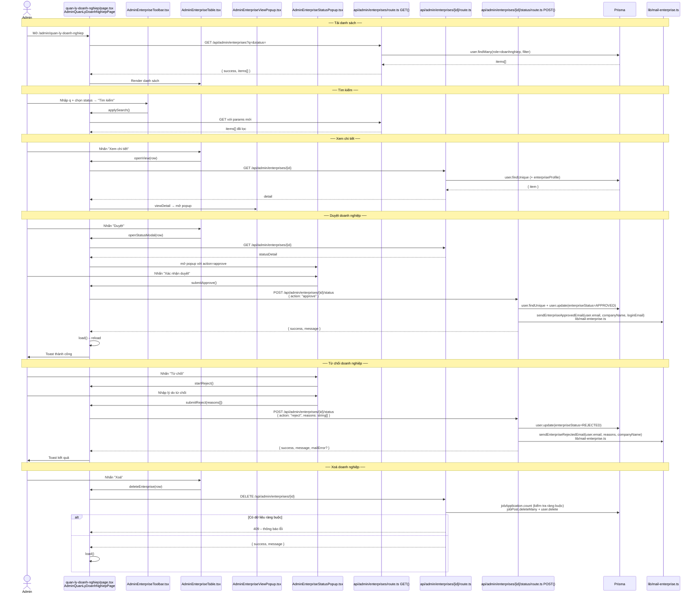
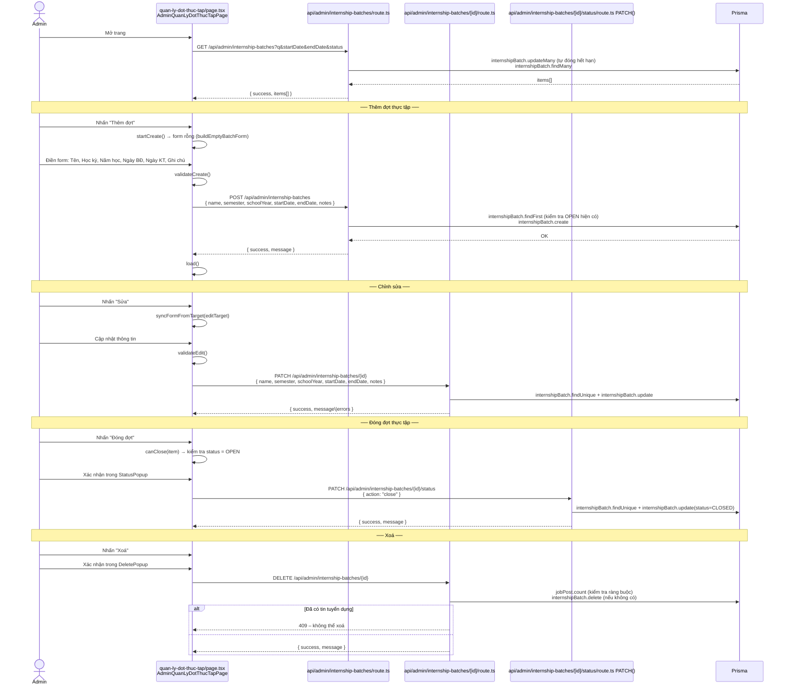
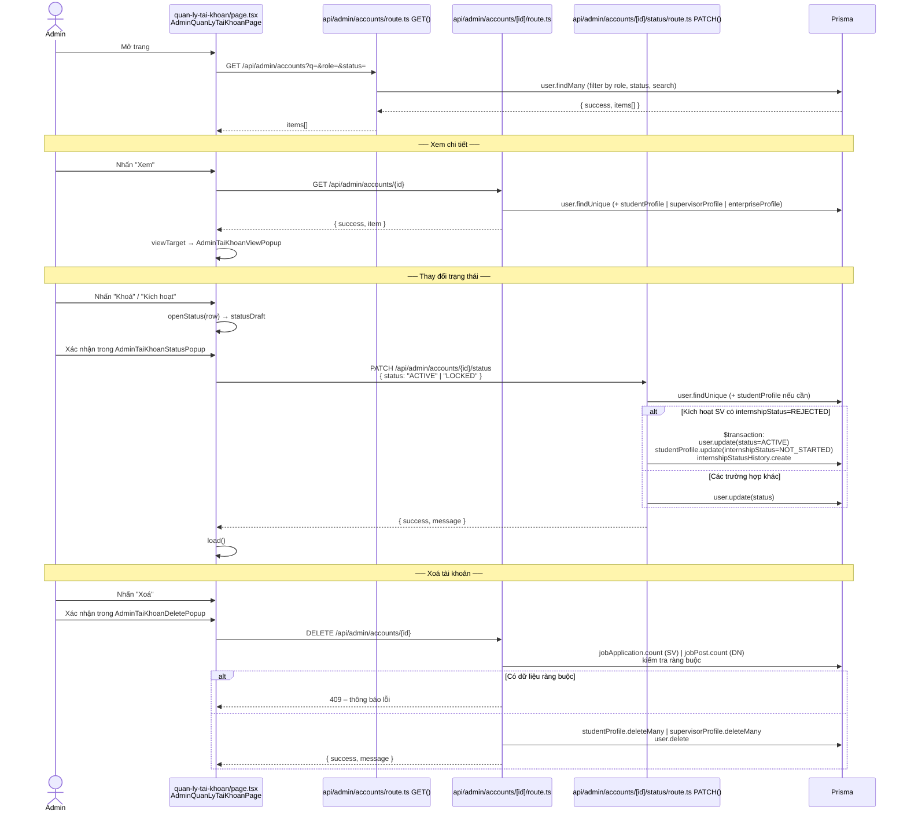
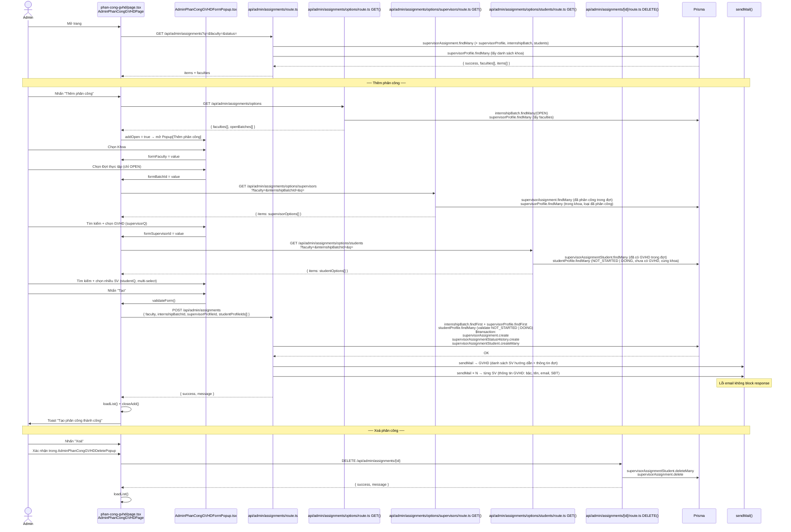
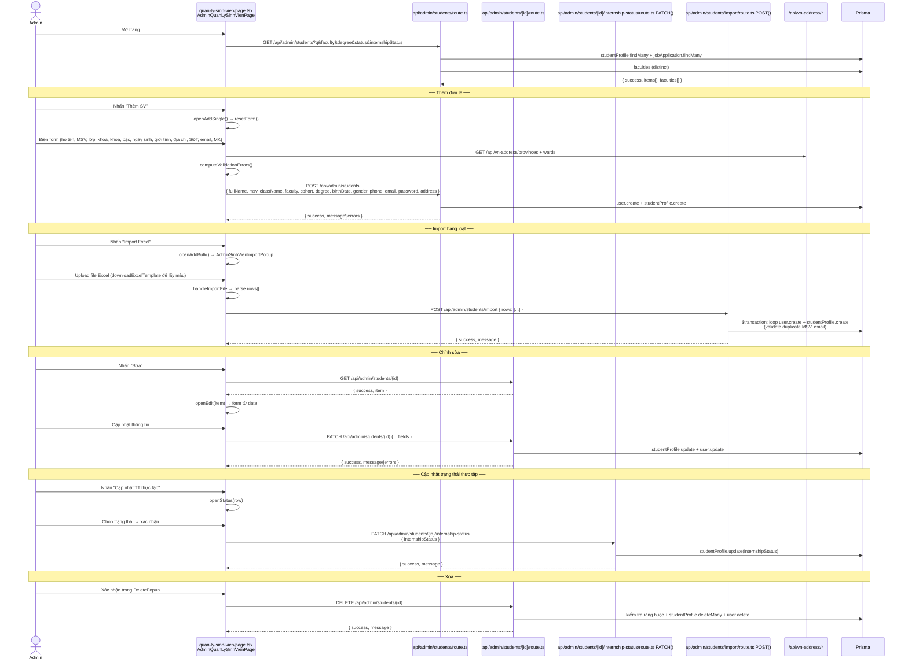
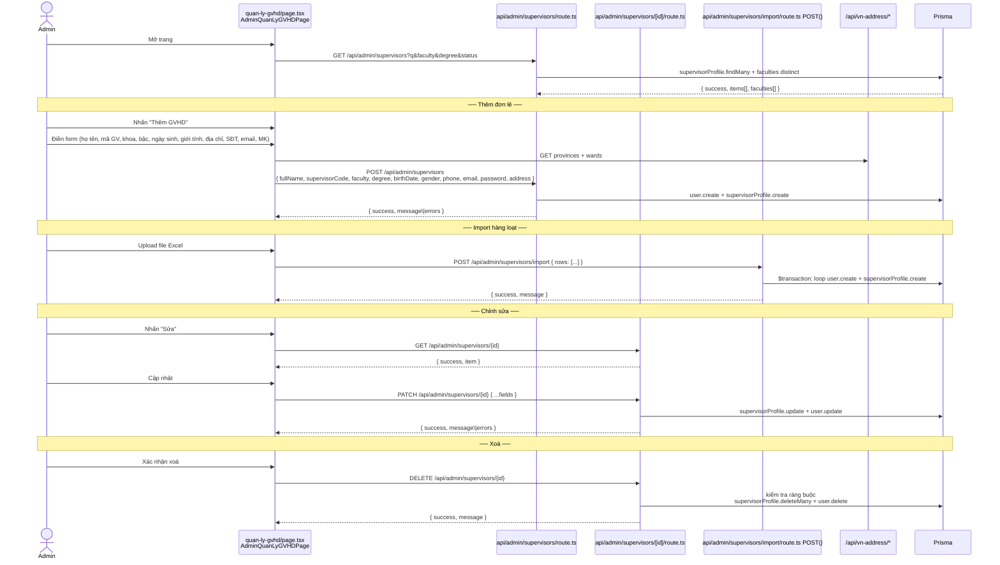
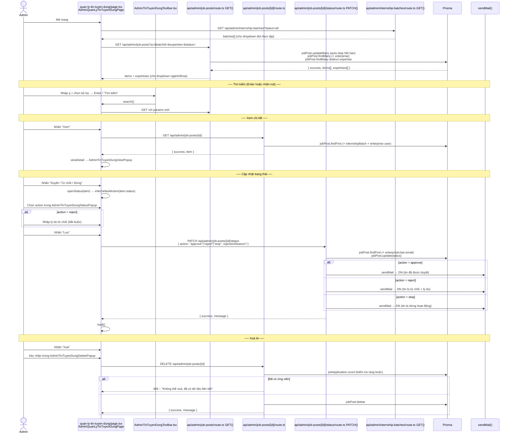
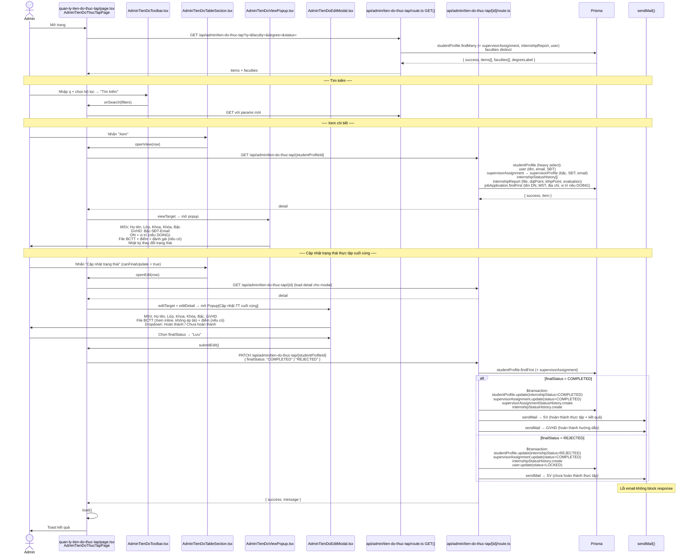
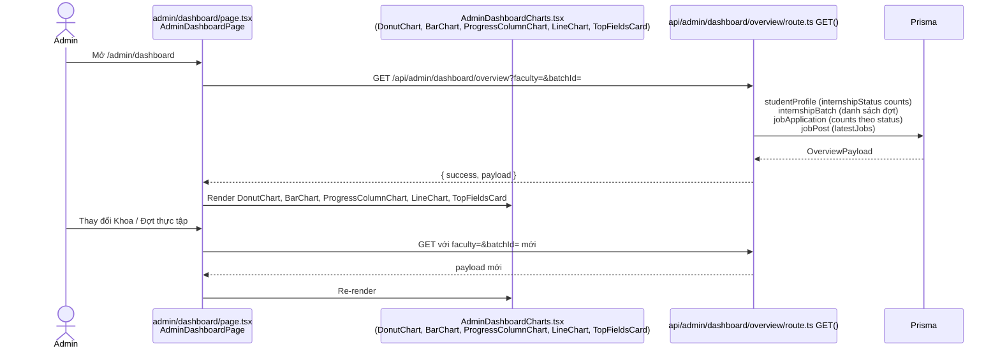

# Module Admin

---

## Bảng tổng quan

| Module | Route | API chính | Email |
|--------|-------|-----------|-------|
| Quản lý doanh nghiệp | `/admin/quan-ly-doanh-nghiep` | `/api/admin/enterprises` | Có (DN: duyệt/từ chối) |
| Quản lý đợt thực tập | `/admin/quan-ly-dot-thuc-tap` | `/api/admin/internship-batches` | Không |
| Quản lý tài khoản | `/admin/quan-ly-tai-khoan` | `/api/admin/accounts` | Không |
| Phân công GVHD | `/admin/phan-cong-gvhd` | `/api/admin/assignments` | Có (GV + SV) |
| Quản lý sinh viên | `/admin/quan-ly-sinh-vien` | `/api/admin/students` | Không |
| Quản lý GVHD | `/admin/quan-ly-gvhd` | `/api/admin/supervisors` | Không |
| Quản lý tin tuyển dụng | `/admin/quan-ly-tin-tuyen-dung` | `/api/admin/job-posts` | Có (DN: duyệt/từ chối/dừng) |
| Quản lý tiến độ thực tập | `/admin/quan-ly-tien-do-thuc-tap` | `/api/admin/tien-do-thuc-tap` | Có (SV + GVHD) |
| Dashboard | `/admin/dashboard` | `/api/admin/dashboard/overview` | Không |

### Ghi chú hiệu năng
- Các popup nặng ở trang admin (view/add/edit/delete/status) đã chuyển sang lazy-load (dynamic import) để giảm lag khi chuyển tab/page và khi click mở popup.
- DashboardShell không còn ép `window.location.reload()` sau mọi mutation; luồng create/update/delete giữ ở mức refresh theo từng page.
- Chuẩn search mới cho API admin: ưu tiên `startsWith` với field định danh (`msv`, `phone`, `email`, `taxCode`), `contains` chỉ áp cho text tự do và chỉ khi `q.length >= 2`.

---

## Tech Stack & cấu trúc thư mục

```
app/
├── admin/
│   ├── layout.tsx                                        # AdminLayout – DashboardShell role="admin"
│   ├── styles/dashboard.module.css
│   ├── components/
│   │   ├── AdminDashboardCharts.tsx                      # DonutChart, BarChart, ProgressColumnChart, LineChart, TopFieldsCard
│   │   ├── EnterpriseViewDetailTable.tsx
│   │   └── EnterpriseStatusCell.tsx
│   ├── dashboard/page.tsx                                # AdminDashboardPage
│   ├── quan-ly-doanh-nghiep/
│   │   ├── page.tsx                                      # AdminQuanLyDoanhNghiepPage
│   │   └── components/
│   │       ├── AdminEnterpriseToolbar.tsx
│   │       ├── AdminEnterpriseTable.tsx
│   │       ├── AdminEnterpriseViewPopup.tsx
│   │       └── AdminEnterpriseStatusPopup.tsx
│   ├── quan-ly-dot-thuc-tap/
│   │   ├── page.tsx                                      # AdminQuanLyDotThucTapPage
│   │   └── components/
│   │       ├── AdminInternshipBatchToolbar.tsx
│   │       ├── AdminInternshipBatchTableSection.tsx
│   │       ├── AdminInternshipBatchEditModal.tsx
│   │       ├── AdminInternshipBatchViewPopup.tsx
│   │       ├── AdminInternshipBatchStatusPopup.tsx
│   │       └── AdminInternshipBatchDeletePopup.tsx
│   ├── quan-ly-tai-khoan/
│   │   ├── page.tsx                                      # AdminQuanLyTaiKhoanPage
│   │   └── components/
│   │       ├── AdminTaiKhoanToolbar.tsx
│   │       ├── AdminTaiKhoanTableSection.tsx
│   │       ├── AdminTaiKhoanViewPopup.tsx  (+ inner ViewBody)
│   │       ├── AdminTaiKhoanStatusPopup.tsx
│   │       └── AdminTaiKhoanDeletePopup.tsx
│   ├── phan-cong-gvhd/
│   │   ├── page.tsx                                      # AdminPhanCongGVHDPage
│   │   └── components/
│   │       ├── AdminPhanCongGVHDToolbar.tsx
│   │       ├── AdminPhanCongGVHDTable.tsx                # exports Props type
│   │       ├── AdminPhanCongGVHDFormPopup.tsx            # exports Props type
│   │       ├── AdminPhanCongGVHDViewPopup.tsx
│   │       └── AdminPhanCongGVHDDeletePopup.tsx
│   ├── quan-ly-sinh-vien/
│   │   ├── page.tsx                                      # AdminQuanLySinhVienPage
│   │   └── components/
│   │       ├── AdminSinhVienToolbar.tsx
│   │       ├── AdminSinhVienTableSection.tsx
│   │       ├── AdminSinhVienFormPopup.tsx
│   │       ├── AdminSinhVienViewPopup.tsx
│   │       ├── AdminSinhVienStatusPopup.tsx
│   │       ├── AdminSinhVienDeletePopup.tsx
│   │       └── AdminSinhVienImportPopup.tsx
│   ├── quan-ly-gvhd/
│   │   ├── page.tsx                                      # AdminQuanLyGVHDPage
│   │   └── components/
│   │       ├── AdminGiangVienToolbar.tsx
│   │       ├── AdminGiangVienTableSection.tsx
│   │       ├── AdminGiangVienFormPopup.tsx
│   │       ├── AdminGiangVienViewPopup.tsx
│   │       ├── AdminGiangVienDeletePopup.tsx
│   │       └── AdminGiangVienImportPopup.tsx
│   ├── quan-ly-tin-tuyen-dung/
│   │   ├── page.tsx                                      # AdminQuanLyTinTuyenDungPage
│   │   └── components/
│   │       ├── AdminTinTuyenDungToolbar.tsx
│   │       ├── AdminTinTuyenDungTableSection.tsx
│   │       ├── AdminTinTuyenDungViewPopup.tsx
│   │       ├── AdminTinTuyenDungStatusPopup.tsx
│   │       └── AdminTinTuyenDungDeletePopup.tsx
│   └── quan-ly-tien-do-thuc-tap/
│       ├── page.tsx                                      # AdminTienDoThucTapPage
│       └── components/
│           ├── AdminTienDoToolbar.tsx
│           ├── AdminTienDoTableSection.tsx
│           ├── AdminTienDoViewPopup.tsx
│           └── AdminTienDoEditModal.tsx
│
└── api/admin/
    ├── dashboard/overview/route.ts                       # GET
    ├── enterprises/route.ts                              # GET
    ├── enterprises/[id]/route.ts                         # GET, DELETE
    ├── enterprises/[id]/status/route.ts                  # POST (approve/reject)
    ├── internship-batches/route.ts                       # GET, POST
    ├── internship-batches/[id]/route.ts                  # GET, PATCH, DELETE
    ├── internship-batches/[id]/status/route.ts           # PATCH (close)
    ├── accounts/route.ts                                 # GET
    ├── accounts/[id]/route.ts                            # GET, DELETE
    ├── accounts/[id]/status/route.ts                     # PATCH (active/locked)
    ├── assignments/route.ts                              # GET, POST
    ├── assignments/[id]/route.ts                         # GET, DELETE
    ├── assignments/options/route.ts                      # GET (faculties + openBatches)
    ├── assignments/options/supervisors/route.ts          # GET
    ├── assignments/options/students/route.ts             # GET
    ├── students/route.ts                                 # GET, POST
    ├── students/[id]/route.ts                            # GET, PATCH, DELETE
    ├── students/[id]/internship-status/route.ts          # PATCH
    ├── students/import/route.ts                          # POST (bulk)
    ├── supervisors/route.ts                              # GET, POST
    ├── supervisors/[id]/route.ts                         # GET, PATCH, DELETE
    ├── supervisors/import/route.ts                       # POST (bulk)
    ├── job-posts/route.ts                                # GET
    ├── job-posts/[id]/route.ts                           # GET, DELETE
    ├── job-posts/[id]/status/route.ts                    # PATCH (approve/reject/stop)
    ├── tien-do-thuc-tap/route.ts                         # GET
    ├── tien-do-thuc-tap/[id]/route.ts                    # GET, PATCH
    └── pending-enterprises/count/route.ts                # GET

lib/
├── constants/
│   ├── admin.ts                                          # ADMIN_DASHBOARD_NAV, TOPBAR_TITLE
│   ├── admin-quan-ly-doanh-nghiep.ts                    # PAGE_SIZE
│   ├── admin-quan-ly-dot-thuc-tap.ts                    # PAGE_SIZE, statusLabel, semesterOptions
│   ├── admin-quan-ly-tai-khoan.ts                       # PAGE_SIZE, roleLabel, statusLabel
│   ├── admin-phan-cong-gvhd.ts                          # PAGE_SIZE, statusLabel, degreeLabel
│   ├── admin-quan-ly-sinh-vien.ts                       # PAGE_SIZE, patterns, degreeLabel, internshipLabel
│   ├── admin-quan-ly-gvhd.ts                            # PAGE_SIZE, patterns, degreeLabel
│   ├── admin-quan-ly-tin-tuyen-dung.ts                  # PAGE_SIZE, statusLabel, workTypeLabel
│   ├── admin-quan-ly-tien-do-thuc-tap.ts                # PAGE_SIZE, internshipStatusLabel, supervisorDegreeLabel
│   ├── admin-students-excel.ts                          # ADMIN_STUDENT_EXCEL_HEADER, sample
│   └── admin-supervisors-excel.ts                       # ADMIN_SUPERVISOR_EXCEL_HEADER, sample
├── types/
│   ├── admin.ts                                         # PendingEnterpriseItem, AdminEnterpriseListItem, AdminEnterpriseDetail
│   ├── admin-dashboard.ts                               # DonutSegment, OverviewPayload, LatestJobItem
│   ├── admin-quan-ly-dot-thuc-tap.ts                    # BatchFormState, InternshipBatchRow
│   ├── admin-quan-ly-tai-khoan.ts                       # Role, AccountStatus, AccountRow
│   ├── admin-phan-cong-gvhd.ts                          # assignment/batch/option types
│   ├── admin-quan-ly-sinh-vien.ts                       # student list/view/form
│   ├── admin-quan-ly-gvhd.ts                            # supervisor list/form
│   ├── admin-quan-ly-tin-tuyen-dung.ts                  # job/batch/status action types
│   └── admin-quan-ly-tien-do-thuc-tap.ts                # ListRow, Detail, statuses
└── utils/
    ├── admin-quan-ly-doanh-nghiep.ts                    # buildAdminEnterprisesListQueryParams
    ├── admin-enterprise-display.ts                      # companyTaxLabel, formatAdminEnterpriseStatusLine
    ├── enterprise-admin-display.ts                      # address/fields formatting, dataUrlFromBase64
    ├── admin-quan-ly-dot-thuc-tap-form.ts               # buildEmptyBatchForm
    ├── admin-quan-ly-dot-thuc-tap-dates.ts              # date helpers for batches
    ├── admin-quan-ly-sinh-vien-form.ts                  # buildEmpty form for student
    ├── admin-quan-ly-sinh-vien-dates.ts                 # birthDate/age helpers
    ├── admin-quan-ly-gvhd-form.ts                       # buildEmpty form for supervisor
    ├── admin-quan-ly-gvhd-dates.ts                      # birthDate helpers
    ├── admin-quan-ly-tai-khoan.ts                       # getAccountViewTitle
    ├── admin-phan-cong-gvhd-display.ts                  # studentDisplay, supervisorDisplay
    ├── admin-quan-ly-tin-tuyen-dung.ts                  # formatDateVi, inferDefaultAction
    └── admin-quan-ly-tien-do-thuc-tap.ts                # supervisorLine
```

---

## 1. Quản lý doanh nghiệp (`/admin/quan-ly-doanh-nghiep`)

### Chức năng
- Xem danh sách doanh nghiệp (lọc theo từ khoá, trạng thái)
- Xem chi tiết hồ sơ doanh nghiệp
- Duyệt / Từ chối đăng ký doanh nghiệp
- Xoá doanh nghiệp

### Trạng thái doanh nghiệp

| Giá trị | Hiển thị | Hành động Admin |
|---------|---------|----------------|
| `PENDING` / `null` | Chờ duyệt | Duyệt / Từ chối |
| `APPROVED` | Đã duyệt | Xem / Xoá |
| `REJECTED` | Đã từ chối | Xem / Xoá |

### Sơ đồ luồng



### API chi tiết

| Route | Method | Prisma | Email |
|-------|--------|--------|-------|
| `/api/admin/enterprises` | GET | `user.findMany(role=doanhnghiep)` | Không |
| `/api/admin/enterprises/[id]` | GET | `user.findUnique` (+ `enterpriseProfile`) | Không |
| `/api/admin/enterprises/[id]` | DELETE | `jobApplication.count` + `jobPost.deleteMany` + `user.delete` | Không |
| `/api/admin/enterprises/[id]/status` | POST | `user.findUnique` + `user.update(enterpriseStatus)` | Có: DN (duyệt hoặc từ chối) |

---

## 2. Quản lý đợt thực tập (`/admin/quan-ly-dot-thuc-tap`)

### Chức năng
- Xem danh sách đợt thực tập (lọc theo tên, ngày bắt đầu, ngày kết thúc, trạng thái)
- Thêm mới, chỉnh sửa, xem chi tiết đợt thực tập
- Đóng đợt thực tập (status → CLOSED)
- Xoá đợt thực tập (chỉ khi chưa có tin tuyển dụng liên kết)

### Trạng thái đợt thực tập

| Giá trị | Hiển thị |
|---------|---------|
| `OPEN` | Đang mở |
| `CLOSED` | Đã đóng |

### Sơ đồ luồng



### API chi tiết

| Route | Method | Prisma | Email |
|-------|--------|--------|-------|
| `/api/admin/internship-batches` | GET | `internshipBatch.updateMany` (auto-close) + `findMany` | Không |
| `/api/admin/internship-batches` | POST | `internshipBatch.findFirst(OPEN)` + `internshipBatch.create` | Không |
| `/api/admin/internship-batches/[id]` | GET | `internshipBatch.findUnique` | Không |
| `/api/admin/internship-batches/[id]` | PATCH | `internshipBatch.findUnique` + `internshipBatch.update` | Không |
| `/api/admin/internship-batches/[id]` | DELETE | `jobPost.count` + `internshipBatch.delete` | Không |
| `/api/admin/internship-batches/[id]/status` | PATCH | `internshipBatch.findUnique` + `internshipBatch.update(CLOSED)` | Không |

---

## 3. Quản lý tài khoản (`/admin/quan-ly-tai-khoan`)

### Chức năng
- Xem danh sách tất cả tài khoản (lọc theo từ khoá, role, trạng thái)
- Xem chi tiết tài khoản
- Thay đổi trạng thái tài khoản: `ACTIVE` ↔ `LOCKED`
- Xoá tài khoản

> **Lưu ý quan trọng:** Khi kích hoạt lại (`ACTIVE`) tài khoản sinh viên có `internshipStatus = REJECTED`, hệ thống tự động reset `internshipStatus = NOT_STARTED` trong `$transaction` và tạo `internshipStatusHistory`.

### Sơ đồ luồng



### API chi tiết

| Route | Method | Prisma | Ghi chú |
|-------|--------|--------|---------|
| `/api/admin/accounts` | GET | `user.findMany` | Lọc theo role, status, search |
| `/api/admin/accounts/[id]` | GET | `user.findUnique` (+ profile tương ứng) | Chi tiết tài khoản |
| `/api/admin/accounts/[id]` | DELETE | `count` + `deleteMany` + `user.delete` | Kiểm tra ràng buộc trước khi xoá |
| `/api/admin/accounts/[id]/status` | PATCH | `user.update` (+ `$transaction` nếu reset SV REJECTED) | Reset internshipStatus nếu SV bị REJECTED được kích hoạt lại |

---

## 4. Phân công GVHD (`/admin/phan-cong-gvhd`)

### Chức năng
- Xem danh sách phân công (lọc theo từ khoá, khoa, trạng thái)
- Thêm phân công mới: chọn Khoa → Đợt thực tập (OPEN) → GVHD (chưa được phân công trong đợt) → nhiều SV (NOT_STARTED / DOING, chưa có GVHD)
- Xem chi tiết phân công
- Xoá phân công
- Gửi email thông báo cho GVHD (danh sách SV) và từng SV (thông tin GVHD)

> **Lưu ý:** Chức năng Sửa phân công đã bị **xoá** — chỉ còn Thêm và Xoá.

### Sơ đồ luồng



### API chi tiết

| Route | Method | Prisma | Email |
|-------|--------|--------|-------|
| `/api/admin/assignments` | GET | `supervisorAssignment.findMany` + `supervisorProfile.findMany` | Không |
| `/api/admin/assignments` | POST | `$transaction`: `supervisorAssignment.create` + `supervisorAssignmentStatusHistory.create` + `supervisorAssignmentStudent.createMany` | Có: GVHD + từng SV |
| `/api/admin/assignments/options` | GET | `internshipBatch.findMany(OPEN)` + `supervisorProfile.findMany` | Không |
| `/api/admin/assignments/options/supervisors` | GET | `supervisorAssignment.findMany` + `supervisorProfile.findMany` | Không |
| `/api/admin/assignments/options/students` | GET | `supervisorAssignmentStudent.findMany` + `studentProfile.findMany` | Không |
| `/api/admin/assignments/[id]` | DELETE | `supervisorAssignmentStudent.deleteMany` + `supervisorAssignment.delete` | Không |

### Email gửi khi tạo phân công

| Người nhận | Nội dung |
|-----------|---------|
| GVHD | Danh sách SV được phân công: MSV – Họ tên – Bậc – Lớp + tên đợt thực tập |
| Mỗi SV | Thông tin GVHD: Bậc – Họ tên – Email – SĐT + tên đợt thực tập |

---

## 5. Quản lý sinh viên (`/admin/quan-ly-sinh-vien`)

### Chức năng
- Xem danh sách sinh viên (lọc theo nhiều tiêu chí)
- Thêm SV đơn lẻ hoặc import hàng loạt từ Excel
- Xem chi tiết, chỉnh sửa thông tin SV
- Thay đổi trạng thái tài khoản + trạng thái thực tập
- Xoá SV

### Sơ đồ luồng



### API chi tiết

| Route | Method | Prisma | Email |
|-------|--------|--------|-------|
| `/api/admin/students` | GET | `studentProfile.findMany` + `jobApplication.findMany` | Không |
| `/api/admin/students` | POST | `user.create` + `studentProfile.create` | Không |
| `/api/admin/students/import` | POST | `$transaction`: loop `user.create` + `studentProfile.create` | Không |
| `/api/admin/students/[id]` | GET | `studentProfile.findFirst` (+ history, report, assignment) | Không |
| `/api/admin/students/[id]` | PATCH | `studentProfile.update` + `user.update` | Không |
| `/api/admin/students/[id]` | DELETE | count checks + `studentProfile.deleteMany` + `user.delete` | Không |
| `/api/admin/students/[id]/internship-status` | PATCH | `studentProfile.update(internshipStatus)` | Không |

---

## 6. Quản lý GVHD (`/admin/quan-ly-gvhd`)

### Chức năng
- Xem danh sách giảng viên (lọc theo từ khoá, khoa, bậc, trạng thái)
- Thêm GVHD đơn lẻ hoặc import hàng loạt từ Excel
- Xem chi tiết, chỉnh sửa thông tin GVHD
- Xoá GVHD

### Sơ đồ luồng



### API chi tiết

| Route | Method | Prisma | Email |
|-------|--------|--------|-------|
| `/api/admin/supervisors` | GET | `supervisorProfile.findMany` | Không |
| `/api/admin/supervisors` | POST | `user.create` + `supervisorProfile.create` | Không |
| `/api/admin/supervisors/import` | POST | `$transaction`: loop `user.create` + `supervisorProfile.create` | Không |
| `/api/admin/supervisors/[id]` | GET | `supervisorProfile.findFirst` (+ `user`) | Không |
| `/api/admin/supervisors/[id]` | PATCH | `supervisorProfile.update` + `user.update` | Không |
| `/api/admin/supervisors/[id]` | DELETE | count checks + `supervisorProfile.deleteMany` + `user.delete` | Không |

---

## 7. Quản lý tin tuyển dụng (`/admin/quan-ly-tin-tuyen-dung`)

### Chức năng
- Xem danh sách tin tuyển dụng (lọc theo tiêu đề/tên DN, đợt thực tập, ngành/khoa, trạng thái)
- Xem chi tiết tin
- Duyệt / Từ chối / Dừng hoạt động tin (kèm email thông báo DN)
- Xoá tin (chỉ khi chưa có ứng viên liên kết)

### Trạng thái & hành động

| Hành động | Trạng thái mới | Email |
|-----------|---------------|-------|
| `approve` | `ACTIVE` | DN: thông báo duyệt thành công |
| `reject` | `REJECTED` | DN: thông báo từ chối + lý do |
| `stop` | `STOPPED` | DN: thông báo dừng hoạt động |

### Sơ đồ luồng



### API chi tiết

| Route | Method | Prisma | Email |
|-------|--------|--------|-------|
| `/api/admin/job-posts` | GET | `jobPost.updateMany` (auto-stop) + `jobPost.findMany` + distinct `expertise` | Không |
| `/api/admin/job-posts/[id]` | GET | `jobPost.findFirst` (+ `internshipBatch` + enterprise) | Không |
| `/api/admin/job-posts/[id]` | DELETE | `jobApplication.count` + `jobPost.delete` | Không |
| `/api/admin/job-posts/[id]/status` | PATCH | `jobPost.findFirst` + `jobPost.update(status)` | Có: DN (approve/reject/stop) |

---

## 8. Quản lý tiến độ thực tập (`/admin/quan-ly-tien-do-thuc-tap`)

### Chức năng
- Xem danh sách SV với trạng thái thực tập (lọc theo từ khoá, khoa, bậc, trạng thái)
- Xem chi tiết tiến độ: thông tin SV, GVHD, DN, lịch sử trạng thái, BCTT, điểm
- Cập nhật trạng thái thực tập cuối cùng: `COMPLETED` hoặc `REJECTED` (Chưa hoàn thành)

### Luồng cập nhật trạng thái cuối cùng

```
finalStatus = COMPLETED:
  → studentProfile.internshipStatus = COMPLETED
  → supervisorAssignment.status = COMPLETED (Hoàn thành hướng dẫn)
  → supervisorAssignmentStatusHistory.create
  → internshipStatusHistory.create
  → sendMail → SV (thông báo hoàn thành + kết quả)
  → sendMail → GVHD (thông báo hoàn thành hướng dẫn)

finalStatus = REJECTED (Chưa hoàn thành thực tập):
  → studentProfile.internshipStatus = REJECTED
  → supervisorAssignment.status = COMPLETED (vẫn hoàn thành hướng dẫn)
  → internshipStatusHistory.create
  → user.update(status = LOCKED) — khoá tài khoản SV
  → sendMail → SV (thông báo chưa hoàn thành)
```

### Sơ đồ luồng



### API chi tiết

| Route | Method | Prisma | Email |
|-------|--------|--------|-------|
| `/api/admin/tien-do-thuc-tap` | GET | `studentProfile.findMany` (+ assignments, reports, user) + distinct `faculties` | Không |
| `/api/admin/tien-do-thuc-tap/[id]` | GET | `studentProfile` (heavy select) + `jobApplication.findFirst` | Không |
| `/api/admin/tien-do-thuc-tap/[id]` | PATCH | `$transaction`: `studentProfile.update` + `supervisorAssignment.update` + `statusHistory.create` + (REJECTED) `user.update(LOCKED)` | Có: SV + GVHD (nếu COMPLETED); SV (nếu REJECTED) |
| `/api/files/internship-report/[id]` | GET | `internshipReport.findFirst` + kiểm tra quyền (`admin/giangvien/sinhvien`) | Không |

### Email gửi khi cập nhật trạng thái cuối cùng

| Điều kiện | Người nhận | Nội dung |
|-----------|-----------|---------|
| `COMPLETED` | SV | Thông báo hoàn thành thực tập, kết quả (điểm ĐQT/KTHP, đánh giá) |
| `COMPLETED` | GVHD | Thông báo hoàn thành hướng dẫn thực tập cho SV |
| `REJECTED` | SV | Thông báo chưa hoàn thành thực tập, tài khoản bị khoá |

---

## Dashboard (`/admin/dashboard`)

### Chức năng
- Biểu đồ tổng quan: phân bố trạng thái thực tập, tiến độ theo khoa, xu hướng theo thời gian
- Lọc theo Khoa và Đợt thực tập

### Sơ đồ luồng



---

## Tổng hợp API toàn module

| API Route | Method | Email | Ghi chú |
|-----------|--------|-------|---------|
| `/api/admin/dashboard/overview` | GET | — | Charts data |
| `/api/admin/enterprises` | GET | — | Danh sách DN |
| `/api/admin/enterprises/[id]` | GET, DELETE | — | Chi tiết + xoá |
| `/api/admin/enterprises/[id]/status` | POST | Có (DN) | Duyệt / từ chối |
| `/api/admin/internship-batches` | GET, POST | — | Đợt thực tập |
| `/api/admin/internship-batches/[id]` | GET, PATCH, DELETE | — | Chi tiết + sửa + xoá |
| `/api/admin/internship-batches/[id]/status` | PATCH | — | Đóng đợt |
| `/api/admin/accounts` | GET | — | Tất cả tài khoản |
| `/api/admin/accounts/[id]` | GET, DELETE | — | Chi tiết + xoá |
| `/api/admin/accounts/[id]/status` | PATCH | — | Khoá/kích hoạt + reset internshipStatus |
| `/api/admin/assignments` | GET, POST | Có (GV + SV) | Phân công + email |
| `/api/admin/assignments/[id]` | GET, DELETE | — | Chi tiết + xoá |
| `/api/admin/assignments/options` | GET | — | Faculties + openBatches |
| `/api/admin/assignments/options/supervisors` | GET | — | GV chưa phân công |
| `/api/admin/assignments/options/students` | GET | — | SV chưa có GVHD |
| `/api/admin/students` | GET, POST | — | Danh sách + thêm mới |
| `/api/admin/students/import` | POST | — | Import bulk từ Excel |
| `/api/admin/students/[id]` | GET, PATCH, DELETE | — | Chi tiết + sửa + xoá |
| `/api/admin/students/[id]/internship-status` | PATCH | — | Cập nhật TT thực tập |
| `/api/admin/supervisors` | GET, POST | — | Danh sách + thêm mới |
| `/api/admin/supervisors/import` | POST | — | Import bulk từ Excel |
| `/api/admin/supervisors/[id]` | GET, PATCH, DELETE | — | Chi tiết + sửa + xoá |
| `/api/admin/job-posts` | GET | — | Danh sách tin + auto-stop + expertises |
| `/api/admin/job-posts/[id]` | GET, DELETE | — | Chi tiết + xoá |
| `/api/admin/job-posts/[id]/status` | PATCH | Có (DN) | Duyệt/từ chối/dừng |
| `/api/admin/tien-do-thuc-tap` | GET | — | Danh sách SV + tiến độ |
| `/api/admin/tien-do-thuc-tap/[id]` | GET, PATCH | Có (SV + GVHD) | Chi tiết + cập nhật cuối |
| `/api/files/internship-report/[id]` | GET | — | Xem/tải file BCTT theo quyền (mặc định inline) |
| `/api/admin/pending-enterprises/count` | GET | — | Số DN chờ duyệt (badge) |
