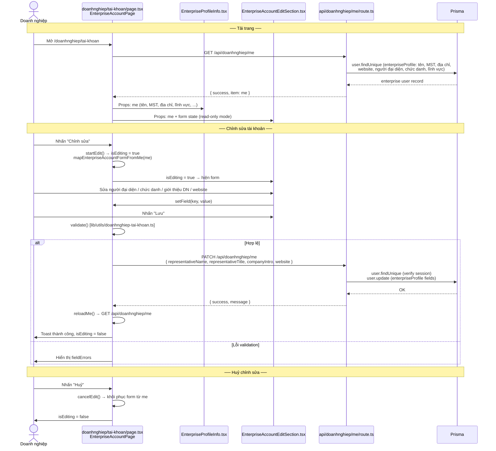
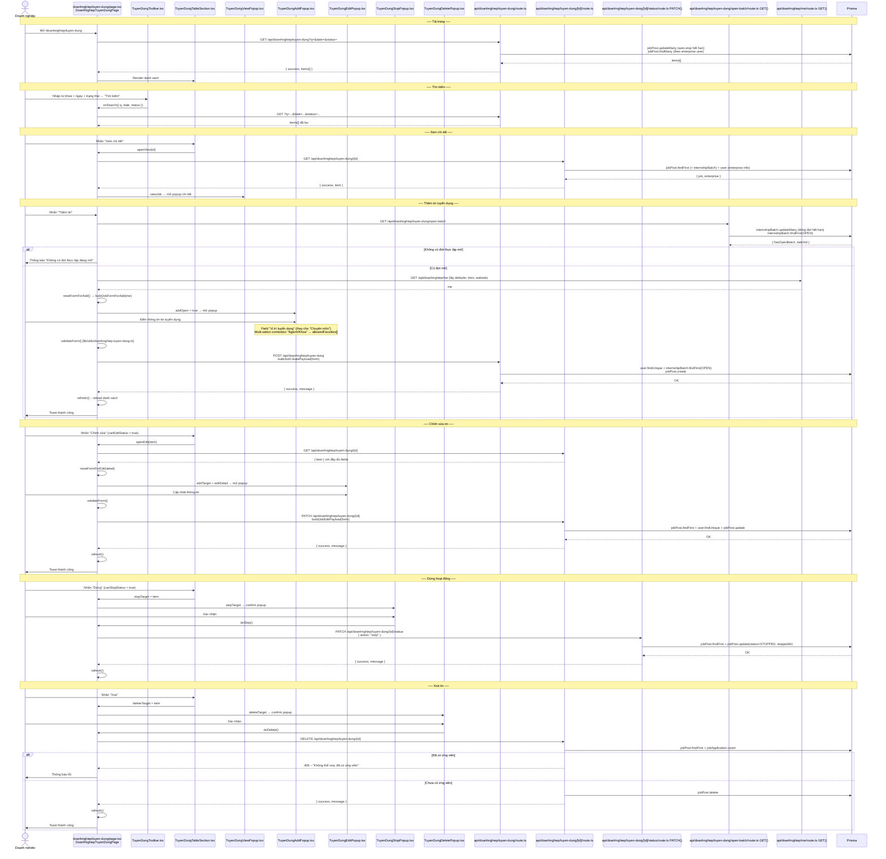
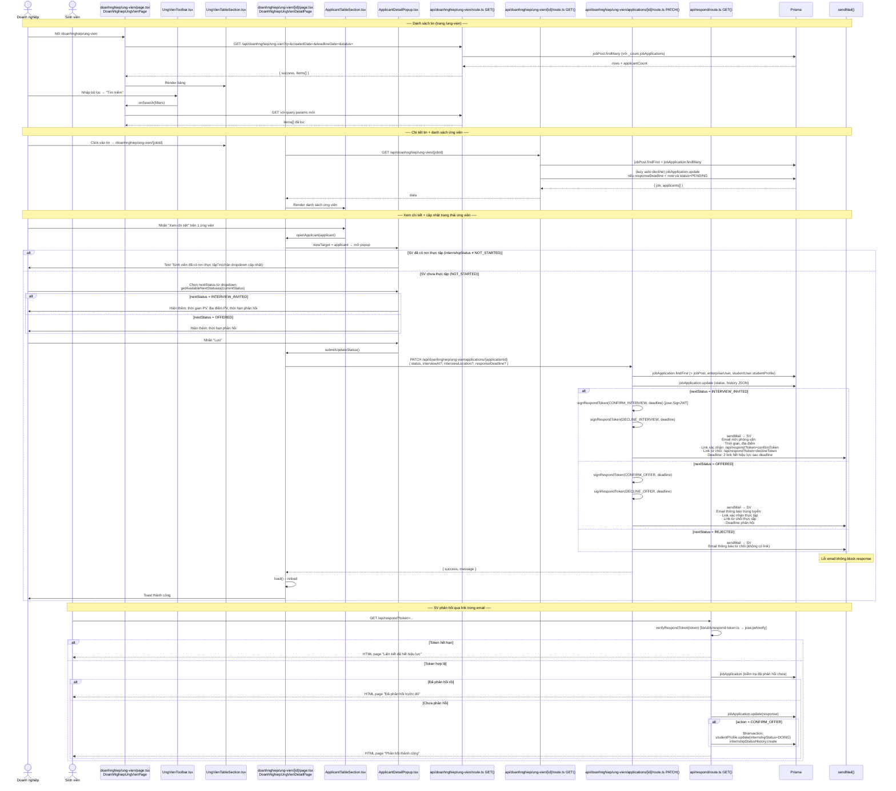
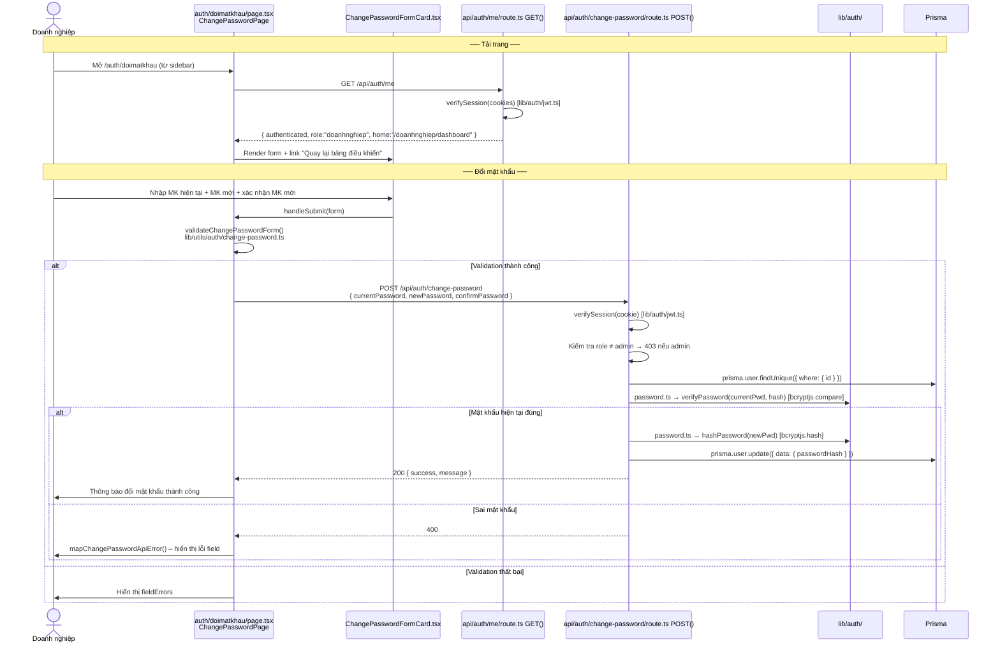
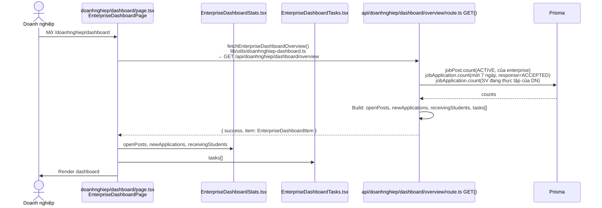
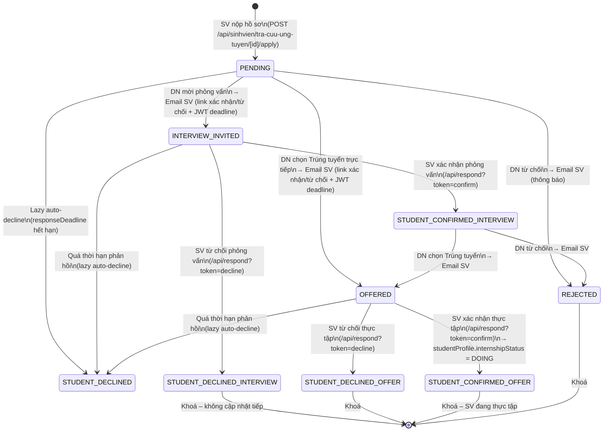

# Module Doanh nghiệp

---

## Bảng tổng quan

| Module | Route | API chính | Email |
|--------|-------|-----------|-------|
| Tài khoản | `/doanhnghiep/tai-khoan` | `/api/doanhnghiep/me` | Không |
| Quản lý tin tuyển dụng | `/doanhnghiep/tuyen-dung` | `/api/doanhnghiep/tuyen-dung` | Không |
| Quản lý ứng viên | `/doanhnghiep/ung-vien` | `/api/doanhnghiep/ung-vien` | Có (SV) |
| Đổi mật khẩu | `/auth/doimatkhau` | `/api/auth/change-password` | Không |
| Dashboard | `/doanhnghiep/dashboard` | `/api/doanhnghiep/dashboard/overview` | Không |

### Ghi chú hiệu năng
- DashboardShell bỏ cơ chế reload toàn trang sau mutation để giảm thời gian chờ khi tạo/sửa/xóa.
- API search doanh nghiệp đã giới hạn query ngắn: `contains` chỉ chạy khi `q.length >= 2` (ví dụ `tuyen-dung`, `ung-vien`).

---

## Tech Stack & cấu trúc thư mục

```
app/
├── doanhnghiep/
│   ├── layout.tsx                                    # DoanhnghiepLayout – DashboardShell role="doanhnghiep"
│   ├── dashboard/
│   │   ├── page.tsx                                  # EnterpriseDashboardPage
│   │   └── components/
│   │       ├── EnterpriseDashboardStats.tsx
│   │       └── EnterpriseDashboardTasks.tsx
│   ├── tai-khoan/
│   │   ├── page.tsx                                  # EnterpriseAccountPage
│   │   └── components/
│   │       ├── EnterpriseProfileInfo.tsx             # Thông tin đọc (read-only)
│   │       └── EnterpriseAccountEditSection.tsx      # Form chỉnh sửa
│   ├── tuyen-dung/
│   │   ├── page.tsx                                  # DoanhNghiepTuyenDungPage
│   │   └── components/
│   │       ├── TuyenDungToolbar.tsx
│   │       ├── TuyenDungTableSection.tsx
│   │       ├── TuyenDungViewPopup.tsx
│   │       ├── TuyenDungAddPopup.tsx
│   │       ├── TuyenDungEditPopup.tsx
│   │       ├── TuyenDungStopPopup.tsx
│   │       ├── TuyenDungDeletePopup.tsx
│   │       └── TuyenDungJobFormFields.tsx            # Form fields dùng chung Add/Edit
│   └── ung-vien/
│       ├── page.tsx                                  # DoanhNghiepUngVienPage (danh sách)
│       ├── components/
│       │   ├── UngVienToolbar.tsx
│       │   └── UngVienTableSection.tsx
│       └── [id]/
│           ├── page.tsx                              # DoanhNghiepUngVienDetailPage (chi tiết)
│           └── components/
│               ├── JobDetailInfo.tsx
│               ├── ApplicantTableSection.tsx
│               └── ApplicantDetailPopup.tsx          # type Props exported
│
├── auth/doimatkhau/
│   ├── page.tsx                                      # ChangePasswordPage
│   └── components/ChangePasswordFormCard.tsx
│
└── api/doanhnghiep/
    ├── me/route.ts                                   # GET, PATCH
    ├── dashboard/overview/route.ts                   # GET
    ├── tuyen-dung/route.ts                           # GET, POST
    ├── tuyen-dung/open-batch/route.ts                # GET
    ├── tuyen-dung/[id]/route.ts                      # GET, PATCH, DELETE
    ├── tuyen-dung/[id]/status/route.ts               # PATCH (dừng hoạt động)
    ├── ung-vien/route.ts                             # GET (danh sách job + applicantCount)
    ├── ung-vien/[id]/route.ts                        # GET (chi tiết job + danh sách ứng viên)
    └── ung-vien/applications/[id]/route.ts           # PATCH (cập nhật trạng thái ứng viên)

lib/
├── constants/
│   ├── doanhnghiep.ts                               # NAV, TOPBAR_TITLE, BUSINESS_FIELD_OPTIONS, regex
│   ├── doanhnghiep-dashboard.ts                     # ENTERPRISE_DASHBOARD_OVERVIEW_ENDPOINT
│   ├── doanhnghiep-tai-khoan.ts                     # ENTERPRISE_ACCOUNT_ME_ENDPOINT, EMPTY_FORM, messages
│   ├── doanhnghiep-tuyen-dung.ts                    # PAGE_SIZE, statusLabel, workTypeLabel, validation
│   ├── doanhnghiep-ung-vien.ts                      # ENDPOINT, PAGE_SIZE, STATUS_LABEL
│   └── doanhnghiep-ung-vien-detail.ts               # applicationStatusLabel/Color, responseLabel, degreeLabel
├── types/
│   ├── doanhnghiep-dashboard.ts                     # EnterpriseDashboardItem, OverviewResponse
│   ├── doanhnghiep-tai-khoan.ts                     # ApiResponse<T>, EnterpriseAccountFormState
│   ├── doanhnghiep-tuyen-dung.ts                    # JobStatus, WorkType, JobListItem, JobFormState
│   ├── doanhnghiep-ung-vien.ts                      # JobStatus, JobRow
│   └── doanhnghiep-ung-vien-detail.ts               # JobApplicationStatus, Applicant, JobDetail, getAvailableNextStatuses()
└── utils/
    ├── doanhnghiep-dashboard.ts                     # fetchEnterpriseDashboardOverview
    ├── doanhnghiep-tai-khoan.ts                     # mapFormFromMe, validateForm, buildPatchPayload
    ├── doanhnghiep-tuyen-dung.ts                    # buildEmptyJobFormState, validateJobForm, buildCreatePayload, canStopStatus
    ├── doanhnghiep-ung-vien.ts                      # buildDoanhNghiepUngVienListUrl, formatDateVi
    └── doanhnghiep-ung-vien-detail.ts               # formatDateTimeVi, formatDateVi
```

---

## 1. Tài khoản (`/doanhnghiep/tai-khoan`)

### Chức năng
- Xem thông tin doanh nghiệp: tên công ty, MST, lĩnh vực kinh doanh, địa chỉ trụ sở, website, người đại diện, chức danh
- Chỉnh sửa: tên người đại diện, chức danh, **giới thiệu về doanh nghiệp** (textarea), website
- File giấy phép + logo ưu tiên lấy từ Cloudinary (`businessLicensePublicId` / `companyLogoPublicId`), fallback dữ liệu cũ base64 nếu còn

### Sơ đồ luồng



### API chi tiết

| Route | Method | Prisma | Trả về |
|-------|--------|--------|--------|
| `/api/doanhnghiep/me` | GET | `user.findUnique` (+ `enterpriseProfile`) | `{ success, item: enterprise fields }` |
| `/api/doanhnghiep/me` | PATCH | `user.findUnique` + `user.update(enterpriseProfile)` | `{ success, message }` hoặc `{ success: false, field, message }` |

### Ghi chú hiệu năng
- Các popup lớn ở trang doanh nghiệp đã được lazy-load (dynamic import) để giảm thời gian click/mở popup.

---

## 2. Quản lý tin tuyển dụng (`/doanhnghiep/tuyen-dung`)

### Chức năng
- Xem danh sách tin tuyển dụng của DN: tiêu đề, ngày đăng, hạn tuyển dụng, trạng thái
- Tìm kiếm theo: từ khoá, ngày đăng, trạng thái
- Thêm mới tin tuyển dụng (yêu cầu có đợt thực tập đang mở)
- Xem chi tiết, chỉnh sửa tin (khi đang ở trạng thái cho phép)
- Dừng hoạt động tin
- Xoá tin (khi chưa có ứng viên)
- Chọn **Ngành/Khoa (allowedFaculties)** cho tin: chỉ SV thuộc khoa được chọn mới thấy tin (rỗng → SV nào cũng thấy)

### Trạng thái tin tuyển dụng (`JobStatus`)

| Giá trị | Hiển thị | Cho phép chỉnh sửa | Cho phép dừng |
|---------|---------|---------------------|---------------|
| `PENDING` | Chờ duyệt | Có | Có |
| `ACTIVE` | Đang hoạt động | Có | Có |
| `REJECTED` | Từ chối duyệt | Có | Có |
| `STOPPED` | Dừng hoạt động | Không | Không |

> **Auto-stop:** API GET `/api/doanhnghiep/tuyen-dung` tự động gọi `jobPost.updateMany` để dừng các tin đã hết hạn (`deadline < now` và status `ACTIVE`).

### Sơ đồ luồng



### API chi tiết

| Route | Method | Body / Query | Prisma | Email |
|-------|--------|-------------|--------|-------|
| `/api/doanhnghiep/tuyen-dung` | GET | `?q, date, status` | `jobPost.updateMany` (auto-stop) + `jobPost.findMany` | Không |
| `/api/doanhnghiep/tuyen-dung` | POST | `buildJobCreatePayload(form)` | `user.findUnique` + `internshipBatch.findFirst(OPEN)` + `jobPost.create` | Không |
| `/api/doanhnghiep/tuyen-dung/open-batch` | GET | — | `internshipBatch.updateMany` + `internshipBatch.findFirst(OPEN)` | Không |
| `/api/doanhnghiep/tuyen-dung/[id]` | GET | — | `jobPost.updateMany` + `jobPost.findFirst` + `user.findUnique` | Không |
| `/api/doanhnghiep/tuyen-dung/[id]` | PATCH | `buildJobEditPayload(form)` | `jobPost.findFirst` + `user.findUnique` + `jobPost.update` | Không |
| `/api/doanhnghiep/tuyen-dung/[id]` | DELETE | — | `jobPost.findFirst` + `jobApplication.count` + `jobPost.delete` | Không |
| `/api/doanhnghiep/tuyen-dung/[id]/status` | PATCH | `{ action: "stop" }` | `jobPost.findFirst` + `jobPost.update(STOPPED, stoppedAt)` | Không |

---

## 3. Quản lý ứng viên (`/doanhnghiep/ung-vien`)

### Chức năng
- **Trang danh sách:** xem tất cả tin tuyển dụng kèm số lượng ứng viên đã nộp hồ sơ
- **Trang chi tiết (`/ung-vien/[id]`):** xem chi tiết tin + danh sách ứng viên đã nộp hồ sơ
- **Popup[Xem chi tiết ứng viên]:** thông tin SV + lịch sử phản hồi + cập nhật trạng thái phản hồi
- **Điều kiện cập nhật:** chỉ khi `internshipStatus = NOT_STARTED` của SV; nếu đã có nơi thực tập → hiển thị thông báo

### Trạng thái ứng viên & luồng phản hồi

```
JobApplicationStatus      Người cập nhật   Trạng thái tiếp theo được phép
─────────────────────     ──────────────   ────────────────────────────────────────────
PENDING                   DN               INTERVIEW_INVITED | OFFERED | REJECTED
INTERVIEW_INVITED         SV (qua email)   → STUDENT_CONFIRMED_INTERVIEW (SV xác nhận)
                                           → STUDENT_DECLINED_INTERVIEW  (SV từ chối)
STUDENT_CONFIRMED_INTER.  DN               OFFERED | REJECTED
STUDENT_DECLINED_INTER.   —                Khoá (không cập nhật tiếp)
OFFERED                   SV (qua email)   → STUDENT_CONFIRMED_OFFER (SV xác nhận → internshipStatus=DOING)
                                           → STUDENT_DECLINED_OFFER  (SV từ chối)
STUDENT_CONFIRMED_OFFER   —                Khoá (SV đã có nơi thực tập)
STUDENT_DECLINED_OFFER    —                Khoá
REJECTED                  —                Khoá
```

> **Lazy auto-decline:** GET `/api/doanhnghiep/ung-vien/[id]` kiểm tra `responseDeadline` đã qua → tự động cập nhật `PENDING` → `STUDENT_DECLINED` nếu deadline hết.

> **Token email links:** khi DN cập nhật `INTERVIEW_INVITED` hoặc `OFFERED`, hệ thống ký JWT `signRespondToken()` (`lib/utils/respond-token.ts`), nhúng vào link `/api/respond?token=...` trong email gửi cho SV.

### Nội dung Popup[Xem chi tiết ứng viên]

- Họ tên, Bậc, SĐT, Email, Địa chỉ hiện tại
- Thư giới thiệu bản thân, File CV đính kèm
- Lịch sử phản hồi giữa DN và SV
- Nếu `internshipStatus ≠ NOT_STARTED` → text "Sinh viên đã có nơi thực tập" (chặn cập nhật)
- Nếu `internshipStatus = NOT_STARTED` → dropdown cập nhật trạng thái + form theo trạng thái:
  - `INTERVIEW_INVITED`: thêm trường thời gian PV, địa điểm PV, thời hạn phản hồi
  - `OFFERED`: thêm trường thời hạn phản hồi

### Sơ đồ luồng



### API chi tiết

| Route | Method | Body | Prisma | Email |
|-------|--------|------|--------|-------|
| `/api/doanhnghiep/ung-vien` | GET | `?q, createdDate, deadlineDate, status` | `jobPost.findMany` (với `_count.jobApplications`) | Không |
| `/api/doanhnghiep/ung-vien/[id]` | GET | — | `jobPost.findFirst` + `jobApplication.findMany` + lazy auto-decline | Không |
| `/api/doanhnghiep/ung-vien/applications/[id]` | PATCH | `{ status, interviewAt?, interviewLocation?, responseDeadline? }` | `jobApplication.findFirst` + `jobApplication.update` | Có: SV |
| `/api/respond` | GET | `?token=` (JWT) | `jobApplication.update` + (CONFIRM_OFFER) `$transaction`: `studentProfile.update(DOING)` + `internshipStatusHistory.create` | Không |

### Email gửi đi khi cập nhật trạng thái ứng viên

| Sự kiện (nextStatus) | Người nhận | Nội dung email |
|--------------------|-----------|----------------|
| `INTERVIEW_INVITED` | SV | Mời phỏng vấn: thời gian, địa điểm, link Xác nhận + Từ chối (JWT token, hết hạn theo `responseDeadline`) |
| `OFFERED` | SV | Thông báo trúng tuyển: link Xác nhận thực tập + Từ chối (JWT token, hết hạn theo `responseDeadline`) |
| `REJECTED` | SV | Thông báo từ chối ứng tuyển (không có link) |

> **Token email:** sử dụng `signRespondToken()` từ `lib/utils/respond-token.ts` (ký `jose.SignJWT`). SV click link → `/api/respond?token=...` → `verifyRespondToken()` → cập nhật DB → trả về trang HTML kết quả.

---

## 4. Đổi mật khẩu (`/auth/doimatkhau`)

### Chức năng
- Đổi mật khẩu khi đã đăng nhập
- Yêu cầu nhập mật khẩu hiện tại để xác thực

### Sơ đồ luồng



### API chi tiết

| Route | Method | Prisma | Email |
|-------|--------|--------|-------|
| `/api/auth/me` | GET | Không (chỉ verify JWT cookie) | Không |
| `/api/auth/change-password` | POST | `user.findUnique` + `user.update(passwordHash)` | Không |

---

## 5. Dashboard (`/doanhnghiep/dashboard`)

### Chức năng
- Tổng quan: số tin đang hoạt động, số ứng viên mới (7 ngày), số SV đang thực tập
- Danh sách task gợi ý hành động tiếp theo

### Sơ đồ luồng



### API chi tiết

| Route | Method | Prisma | Trả về |
|-------|--------|--------|--------|
| `/api/doanhnghiep/dashboard/overview` | GET | `jobPost.count` + `jobApplication.count` ×2 | `{ openPosts, newApplications, receivingStudents, tasks[] }` |

---

## Tổng hợp luồng trạng thái ứng viên



---

## Tổng hợp API toàn module

| API Route | Method | Auth | Email | Ghi chú |
|-----------|--------|------|-------|---------|
| `/api/doanhnghiep/me` | GET | doanhnghiep | — | Thông tin tài khoản DN |
| `/api/doanhnghiep/me` | PATCH | doanhnghiep | — | Cập nhật thông tin DN |
| `/api/doanhnghiep/dashboard/overview` | GET | doanhnghiep | — | Tổng quan dashboard |
| `/api/doanhnghiep/tuyen-dung` | GET | doanhnghiep | — | Danh sách tin + auto-stop hết hạn |
| `/api/doanhnghiep/tuyen-dung` | POST | doanhnghiep | — | Tạo tin tuyển dụng mới |
| `/api/doanhnghiep/tuyen-dung/open-batch` | GET | doanhnghiep | — | Kiểm tra đợt thực tập đang mở |
| `/api/doanhnghiep/tuyen-dung/[id]` | GET | doanhnghiep | — | Chi tiết tin tuyển dụng |
| `/api/doanhnghiep/tuyen-dung/[id]` | PATCH | doanhnghiep | — | Chỉnh sửa tin |
| `/api/doanhnghiep/tuyen-dung/[id]` | DELETE | doanhnghiep | — | Xoá tin (nếu chưa có ứng viên) |
| `/api/doanhnghiep/tuyen-dung/[id]/status` | PATCH | doanhnghiep | — | Dừng hoạt động tin |
| `/api/doanhnghiep/ung-vien` | GET | doanhnghiep | — | Danh sách job + số ứng viên |
| `/api/doanhnghiep/ung-vien/[id]` | GET | doanhnghiep | — | Chi tiết job + ứng viên + lazy auto-decline |
| `/api/doanhnghiep/ung-vien/applications/[id]` | PATCH | doanhnghiep | Có | Cập nhật trạng thái ứng viên + email SV |
| `/api/respond` | GET | Token JWT | — | SV phản hồi qua link email |
| `/api/auth/me` | GET | cookie | — | Lấy role + home URL |
| `/api/auth/change-password` | POST | cookie | — | Đổi mật khẩu |
