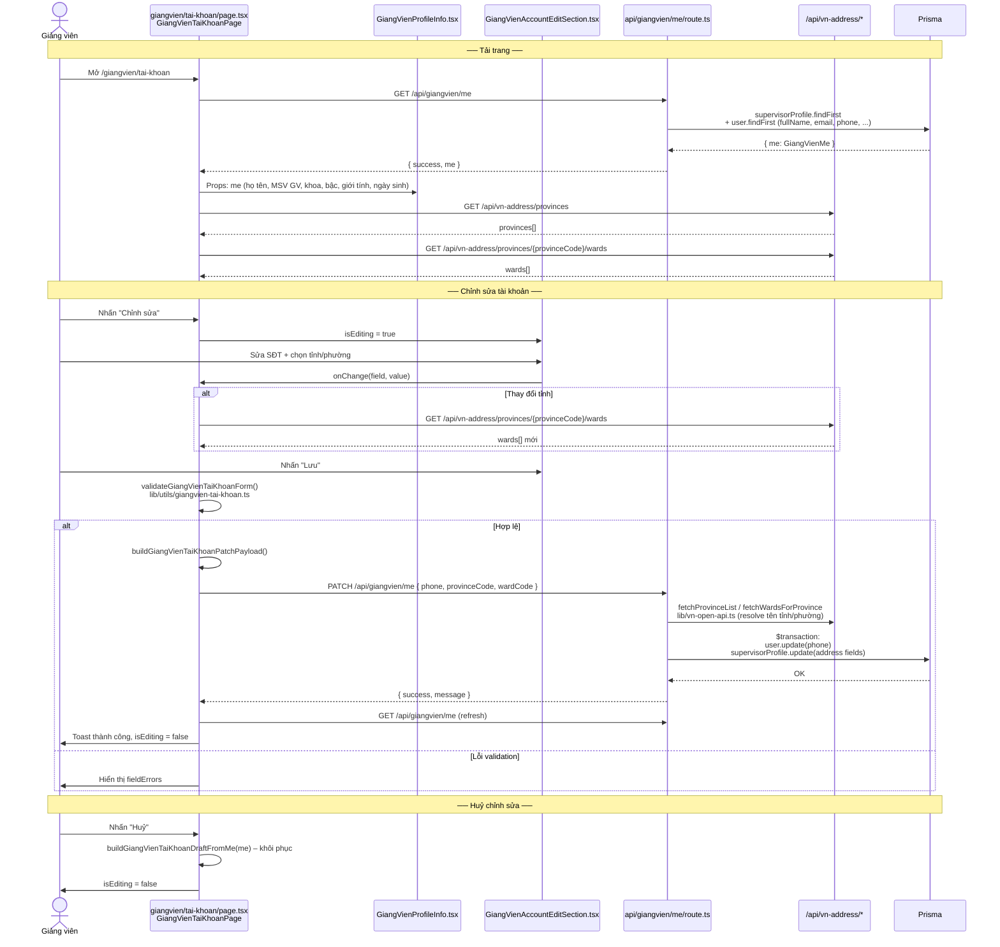
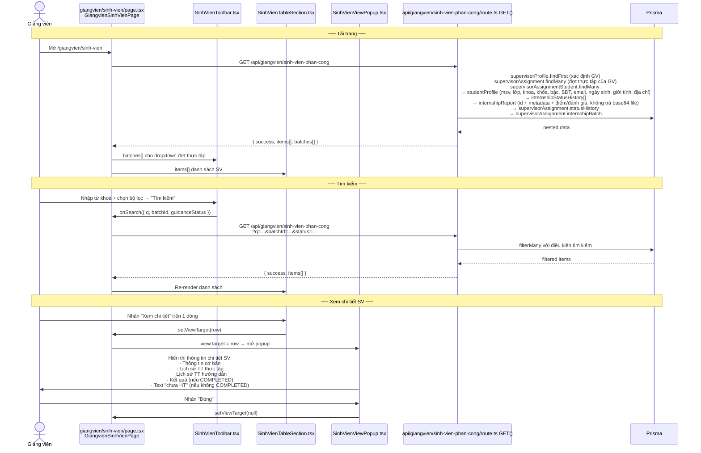
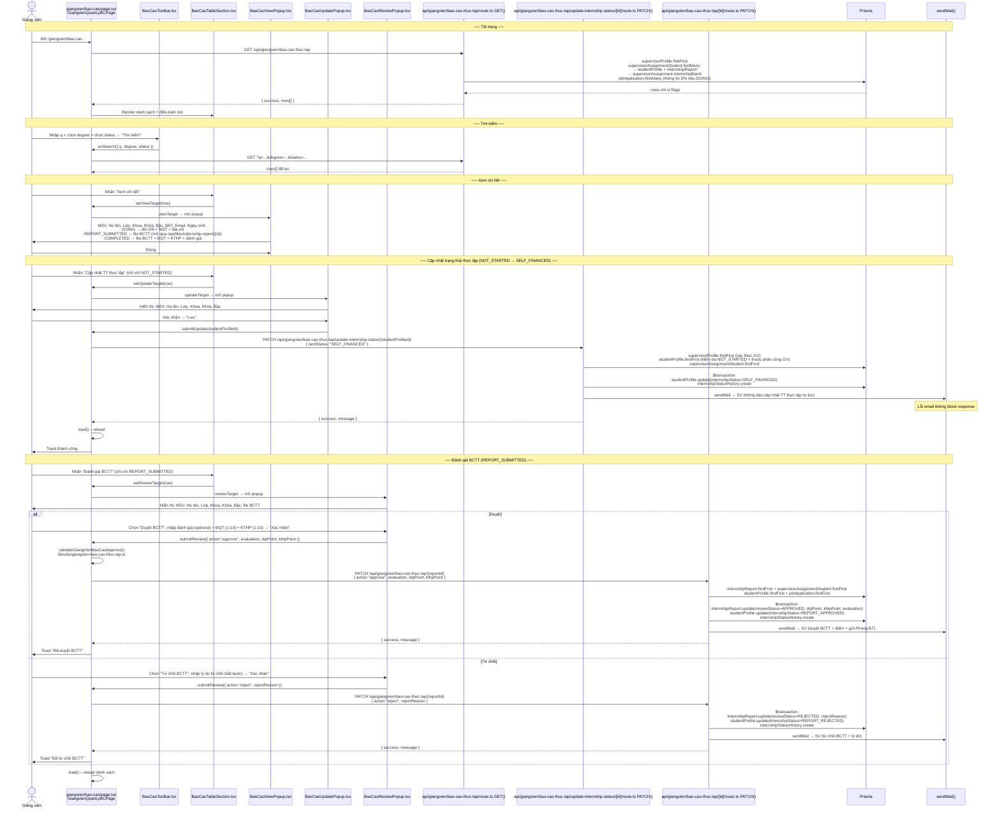
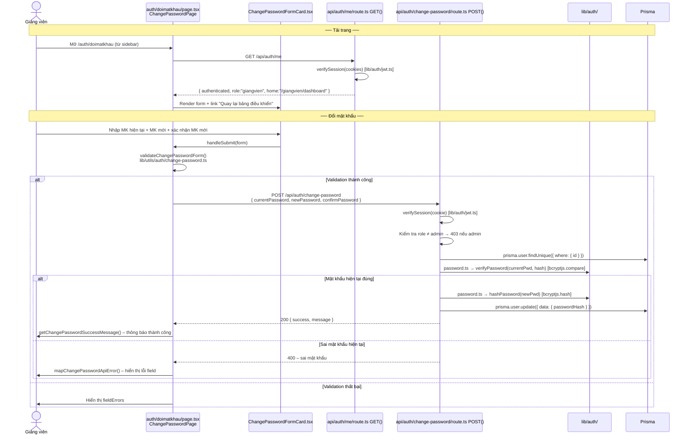
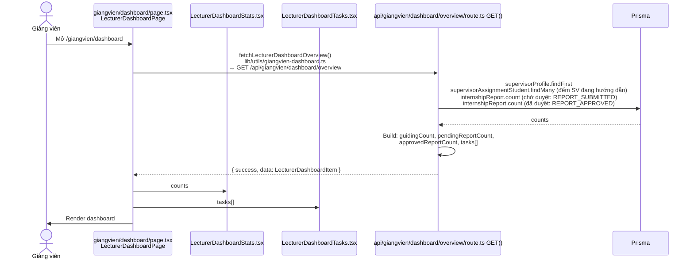
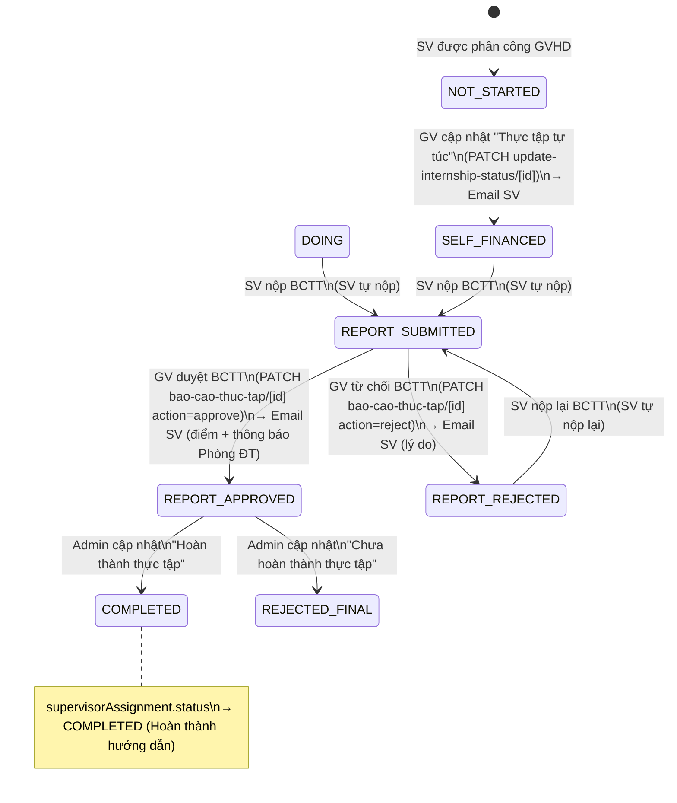

# Module Giảng viên

---

## Bảng tổng quan

| Module | Route | API chính | Email |
|--------|-------|-----------|-------|
| Tài khoản | `/giangvien/tai-khoan` | `/api/giangvien/me` | Không |
| Quản lý SV phân công | `/giangvien/sinh-vien` | `/api/giangvien/sinh-vien-phan-cong` | Không |
| Quản lý BCTT | `/giangvien/bao-cao` | `/api/giangvien/bao-cao-thuc-tap` | Có (SV) |
| Đổi mật khẩu | `/auth/doimatkhau` | `/api/auth/change-password` | Không |
| Dashboard | `/giangvien/dashboard` | `/api/giangvien/dashboard/overview` | Không |

### Ghi chú hiệu năng
- Popup ở trang `giangvien/bao-cao` đã lazy-load; file BCTT hiển thị qua `/api/files/internship-report/[id]` (inline mặc định), không còn nhúng base64 vào payload list.
- DashboardShell bỏ reload toàn trang sau mutation để thao tác cập nhật trạng thái phản hồi nhanh hơn.
- API search giảng viên dùng chuẩn mới: `msv` ưu tiên `startsWith`; `contains` cho tên chỉ khi `q.length >= 2`.

---

## Tech Stack & cấu trúc thư mục

```
app/
├── giangvien/
│   ├── layout.tsx                                   # GiangvienLayout – bọc DashboardShell role="giangvien"
│   ├── dashboard/
│   │   ├── page.tsx                                 # LecturerDashboardPage
│   │   └── components/
│   │       ├── LecturerDashboardStats.tsx
│   │       └── LecturerDashboardTasks.tsx
│   ├── tai-khoan/
│   │   ├── page.tsx                                 # GiangVienTaiKhoanPage
│   │   └── components/
│   │       ├── GiangVienProfileInfo.tsx             # Thông tin cá nhân (read-only + editable)
│   │       └── GiangVienAccountEditSection.tsx      # Form chỉnh sửa tài khoản
│   ├── sinh-vien/
│   │   ├── page.tsx                                 # GiangvienSinhVienPage
│   │   └── components/
│   │       ├── SinhVienToolbar.tsx
│   │       ├── SinhVienTableSection.tsx
│   │       └── SinhVienViewPopup.tsx
│   └── bao-cao/
│       ├── page.tsx                                 # GiangvienQuanLyBCPage
│       └── components/
│           ├── BaoCaoToolbar.tsx
│           ├── BaoCaoTableSection.tsx
│           ├── BaoCaoViewPopup.tsx
│           ├── BaoCaoUpdatePopup.tsx                # Popup cập nhật trạng thái thực tập
│           └── BaoCaoReviewPopup.tsx                # Popup duyệt/từ chối BCTT
│
├── auth/doimatkhau/
│   ├── page.tsx                                     # ChangePasswordPage
│   └── components/ChangePasswordFormCard.tsx
│
└── api/giangvien/
    ├── me/route.ts                                  # GET, PATCH
    ├── sinh-vien-phan-cong/route.ts                 # GET
    ├── bao-cao-thuc-tap/route.ts                    # GET
    ├── bao-cao-thuc-tap/[id]/route.ts               # PATCH (duyệt/từ chối BCTT)
    ├── bao-cao-thuc-tap/update-internship-status/[id]/route.ts  # PATCH (cập nhật TT thực tập)
    └── dashboard/overview/route.ts                  # GET

lib/
├── constants/
│   ├── giangvien.ts                                 # GIANGVIEN_DASHBOARD_NAV, TOPBAR_TITLE
│   ├── giangvien-dashboard.ts                       # GIANGVIEN_DASHBOARD_OVERVIEW_ENDPOINT
│   ├── giangvien-sinh-vien.ts                       # GIANGVIEN_SINH_VIEN_ENDPOINT, degreeLabel, statusLabel
│   ├── giangvien-bao-cao-thuc-tap.ts                # degreeLabel, pointPattern, validation messages
│   └── giangvien-tai-khoan.ts                       # degreeLabel, genderLabel, PHONE_PATTERN
├── types/
│   ├── giangvien-dashboard.ts                       # LecturerDashboardItem, LecturerDashboardOverviewResponse
│   ├── giangvien-sinh-vien.ts                       # Degree, GuidanceStatus, Gender, InternshipStatus, Row, BatchOption
│   ├── giangvien-bao-cao-thuc-tap.ts                # Degree, InternshipStatus, ReportReviewStatus, Report, Row
│   └── giangvien-tai-khoan.ts                       # Degree, Gender, Province, Ward, GiangVienMe, GiangVienTaiKhoanDraft
└── utils/
    ├── giangvien-dashboard.ts                       # fetchLecturerDashboardOverview, getLecturerDashboardErrorMessage
    ├── giangvien-sinh-vien.ts                       # buildGiangVienSinhVienQueryParams, formatDateVi
    ├── giangvien-bao-cao-thuc-tap.ts                # validateGiangVienBaoCaoApprove, formatDateVi
    └── giangvien-tai-khoan.ts                       # buildDraftFromMe, validateForm, buildPatchPayload
```

---

## 1. Tài khoản (`/giangvien/tai-khoan`)

### Chức năng
- Xem thông tin cá nhân: họ tên, MSV giảng viên, khoa, bậc, giới tính, ngày sinh, địa chỉ, SĐT, email
- Chỉnh sửa: SĐT, địa chỉ thường trú (tỉnh/phường)
- Chọn địa chỉ qua dropdown tỉnh → phường (gọi API VN address)

### Sơ đồ luồng



### API chi tiết

| Route | Method | Prisma | Trả về |
|-------|--------|--------|--------|
| `/api/giangvien/me` | GET | `supervisorProfile.findFirst` + `user.findFirst` | `{ success, me: GiangVienMe }` |
| `/api/giangvien/me` | PATCH | `$transaction`: `user.update(phone)` + `supervisorProfile.update(address)` | `{ success, message }` hoặc `{ errors }` |

---

## 2. Quản lý sinh viên được phân công (`/giangvien/sinh-vien`)

### Chức năng
- Xem danh sách SV được phân công (theo đợt thực tập): STT, MSV, Họ tên, Khóa, Bậc, Trạng thái hướng dẫn
- Tìm kiếm theo: từ khoá (MSV / Họ tên), dropdown đợt thực tập, dropdown trạng thái hướng dẫn
- Xem chi tiết SV qua `Popup[Xem chi tiết SV]`

### Trạng thái hướng dẫn (`GuidanceStatus`)

| Giá trị | Hiển thị |
|---------|---------|
| `GUIDING` | Đang hướng dẫn |
| `COMPLETED` | Hoàn thành hướng dẫn |

### Nội dung Popup[Xem chi tiết SV]

- **Thông tin cơ bản:** MSV, Họ tên, Lớp, Khoa, Khóa, Bậc, SĐT, Email, Ngày sinh, Giới tính, Địa chỉ thường trú
- **Lịch sử trạng thái thực tập** (từ `internshipStatusHistory`)
- **Lịch sử trạng thái hướng dẫn** (từ `supervisorAssignment.statusHistory`)
- **Nếu đã hoàn thành hướng dẫn + SV `COMPLETED`:** hiển thị ĐQT, KTHP, file BCTT, đánh giá
- **Nếu SV chưa hoàn thành thực tập:** hiển thị text "SV chưa hoàn thành thực tập"

### Sơ đồ luồng



### API chi tiết

| Route | Method | Prisma | Trả về |
|-------|--------|--------|--------|
| `/api/giangvien/sinh-vien-phan-cong` | GET | `supervisorProfile.findFirst` + `supervisorAssignment.findMany` + `supervisorAssignmentStudent.findMany` (nested: `studentProfile`, `internshipStatusHistory`, `internshipReport`, `supervisorAssignment.statusHistory + internshipBatch`) | `{ success, items[], batches[] }` |

**Query params:**

| Param | Mô tả |
|-------|-------|
| `q` | Tìm theo MSV hoặc họ tên |
| `batchId` | Lọc theo đợt thực tập |
| `status` | Lọc theo trạng thái hướng dẫn (`GUIDING` / `COMPLETED`) |

---

## 3. Quản lý BCTT (`/giangvien/bao-cao`)

### Chức năng
- Xem danh sách SV được phân công: STT, MSV, Họ tên, Khóa, Bậc, Trạng thái thực tập
- Tìm kiếm theo: từ khoá (MSV/Họ tên), dropdown Bậc, dropdown Trạng thái thực tập
- Mỗi dòng có:
  - **"Xem chi tiết"** — luôn hiển thị
  - **"Cập nhật TT thực tập"** — chỉ hiển thị với SV có `internshipStatus = NOT_STARTED`
  - **"Đánh giá BCTT"** — chỉ hiển thị với SV có `internshipStatus = REPORT_SUBMITTED`
- **Popup[Xem chi tiết]:** thông tin SV + trạng thái thực tập hiện tại + dữ liệu điều kiện
- **Popup[Cập nhật TT thực tập]:** chỉ đổi sang `SELF_FINANCED`, gửi email SV
- **Popup[Duyệt BCTT]:** tách rõ 2 chế độ:
  - **Duyệt BCTT:** hiện `Nhận xét/đánh giá`, `Điểm ĐQT`, `Điểm KTHP`
  - **Từ chối BCTT:** chỉ hiện `Lý do từ chối` (bắt buộc)
  - Nút hành động popup: `Xác nhận` + `Hủy`

### Nội dung Popup[Xem chi tiết]

| Điều kiện `internshipStatus` | Thêm hiển thị |
|-----------------------------|---------------|
| `DOING` | Tên DN, MST, địa chỉ DN |
| `REPORT_SUBMITTED` | File BCTT |
| `COMPLETED` | File BCTT + ĐQT + KTHP + đánh giá |
| Các trạng thái khác | Chỉ thông tin cơ bản |

### Popup[Duyệt BCTT] — logic

```
Mode = Duyệt:
- Textarea[Nhận xét/đánh giá]: không bắt buộc
- Input[ĐQT]: số 1–10, bắt buộc
- Input[KTHP]: số 1–10, bắt buộc

Mode = Từ chối:
- Textarea[Lý do từ chối]: bắt buộc

Nút submit chung: "Xác nhận"
- Nếu mode Duyệt  -> PATCH action=APPROVE
- Nếu mode Từ chối -> PATCH action=REJECT
```

### Sơ đồ luồng



### API chi tiết

| Route | Method | Body | Prisma | Email |
|-------|--------|------|--------|-------|
| `/api/giangvien/bao-cao-thuc-tap` | GET | `?q, degree, status` | `supervisorProfile.findFirst` + `supervisorAssignmentStudent.findMany` (nested: `studentProfile`, `internshipReport`, `internshipBatch`) + `jobApplication.findMany` | Không |
| `/api/files/internship-report/[id]` | GET | `?download=1` (optional) | `internshipReport.findFirst` + check quyền (`admin/giangvien/sinhvien`) + proxy Cloudinary/base64 fallback | Không |
| `/api/giangvien/bao-cao-thuc-tap/update-internship-status/[id]` | PATCH | `{ nextStatus }` | `supervisorProfile.findFirst` + `studentProfile.findFirst` + `supervisorAssignmentStudent.findFirst` + `$transaction`: `studentProfile.update` + `internshipStatusHistory.create` | SV |
| `/api/giangvien/bao-cao-thuc-tap/[id]` | PATCH | `{ action, evaluation?, dqtPoint?, kthpPoint?, rejectReason? }` | `internshipReport.findFirst` + `supervisorAssignmentStudent.findFirst` + `studentProfile.findFirst` + `jobApplication.findFirst` + `$transaction`: `internshipReport.update` + `studentProfile.update` + `internshipStatusHistory.create` | SV |

### Email gửi đi

| Sự kiện | API | Người nhận | Nội dung |
|---------|-----|-----------|---------|
| Cập nhật TT thực tập tự túc | `update-internship-status/[id]` PATCH | SV | Thông báo trạng thái thực tập đã được cập nhật thành "Thực tập tự túc" |
| Duyệt BCTT | `bao-cao-thuc-tap/[id]` PATCH (approve) | SV | BCTT đã được duyệt, điểm ĐQT/KTHP, thông báo gửi Phòng Đào tạo |
| Từ chối BCTT | `bao-cao-thuc-tap/[id]` PATCH (reject) | SV | Lý do từ chối BCTT, hướng dẫn nộp lại |

---

## 4. Đổi mật khẩu (`/auth/doimatkhau`)

### Chức năng
- Đổi mật khẩu khi đã đăng nhập
- Yêu cầu nhập mật khẩu hiện tại để xác thực

### Sơ đồ luồng



### API chi tiết

| Route | Method | Prisma | Email |
|-------|--------|--------|-------|
| `/api/auth/me` | GET | Không (chỉ verify JWT cookie) | Không |
| `/api/auth/change-password` | POST | `user.findUnique` + `user.update(passwordHash)` | Không |

---

## 5. Dashboard (`/giangvien/dashboard`)

### Chức năng
- Tổng quan: số SV đang hướng dẫn, số BCTT chờ duyệt, số BCTT đã duyệt
- Danh sách task gợi ý hành động tiếp theo

### Sơ đồ luồng



### API chi tiết

| Route | Method | Prisma | Trả về |
|-------|--------|--------|--------|
| `/api/giangvien/dashboard/overview` | GET | `supervisorProfile.findFirst` + `supervisorAssignmentStudent.findMany` + `internshipReport.count` ×2 | `{ guidingCount, pendingReportCount, approvedReportCount, tasks[] }` |

---

## Tổng hợp trạng thái BCTT từ góc độ Giảng viên



---

## Tổng hợp API toàn module

| API Route | Method | Auth | Email | Ghi chú |
|-----------|--------|------|-------|---------|
| `/api/giangvien/me` | GET | giangvien | — | Thông tin tài khoản + hồ sơ |
| `/api/giangvien/me` | PATCH | giangvien | — | Cập nhật SĐT + địa chỉ |
| `/api/giangvien/sinh-vien-phan-cong` | GET | giangvien | — | Danh sách SV phân công + chi tiết (report trả `reportUrl`, không trả file base64) |
| `/api/giangvien/bao-cao-thuc-tap` | GET | giangvien | — | Danh sách SV + metadata BCTT (đã tách file nặng khỏi payload) |
| `/api/files/internship-report/[id]` | GET | admin/giangvien/sinhvien | — | Xem/tải file BCTT theo quyền |
| `/api/giangvien/bao-cao-thuc-tap/update-internship-status/[id]` | PATCH | giangvien | Có | Cập nhật TT thực tập → SELF_FINANCED |
| `/api/giangvien/bao-cao-thuc-tap/[id]` | PATCH | giangvien | Có | Duyệt / Từ chối BCTT |
| `/api/giangvien/dashboard/overview` | GET | giangvien | — | Tổng quan dashboard |
| `/api/auth/me` | GET | cookie | — | Lấy role + home URL |
| `/api/auth/change-password` | POST | cookie | — | Đổi mật khẩu |
