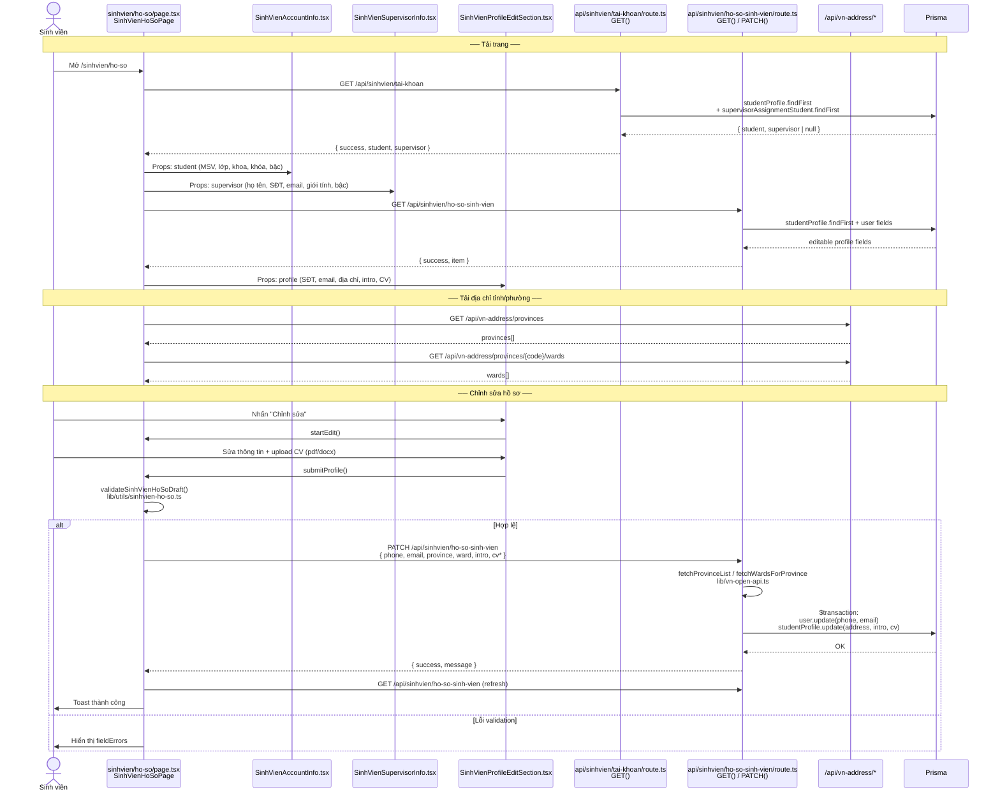
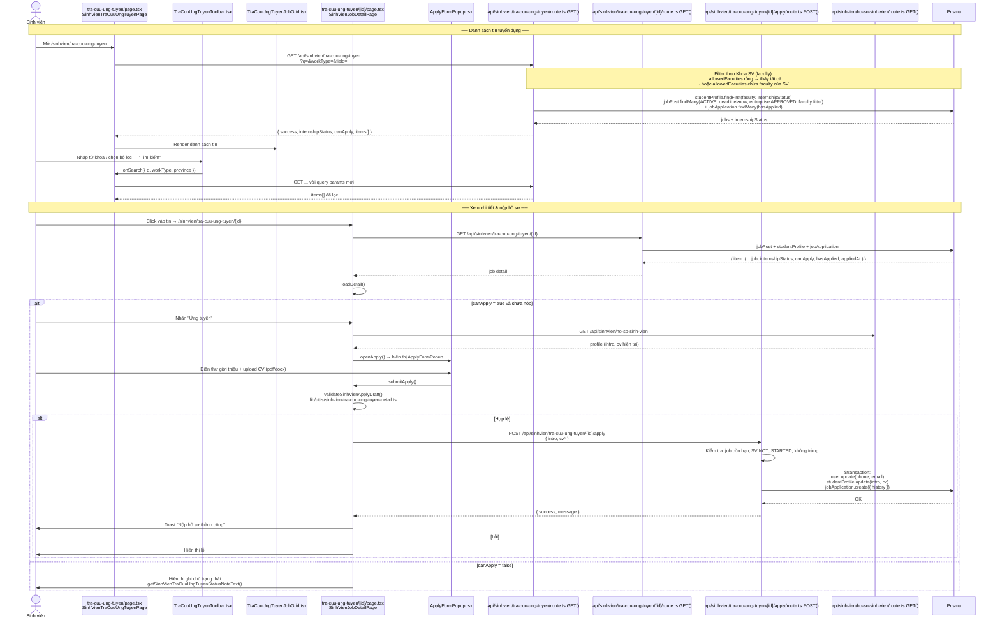
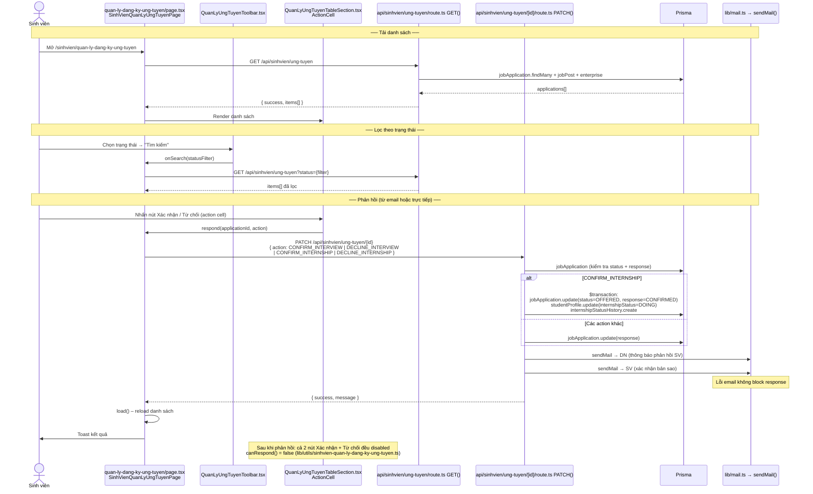
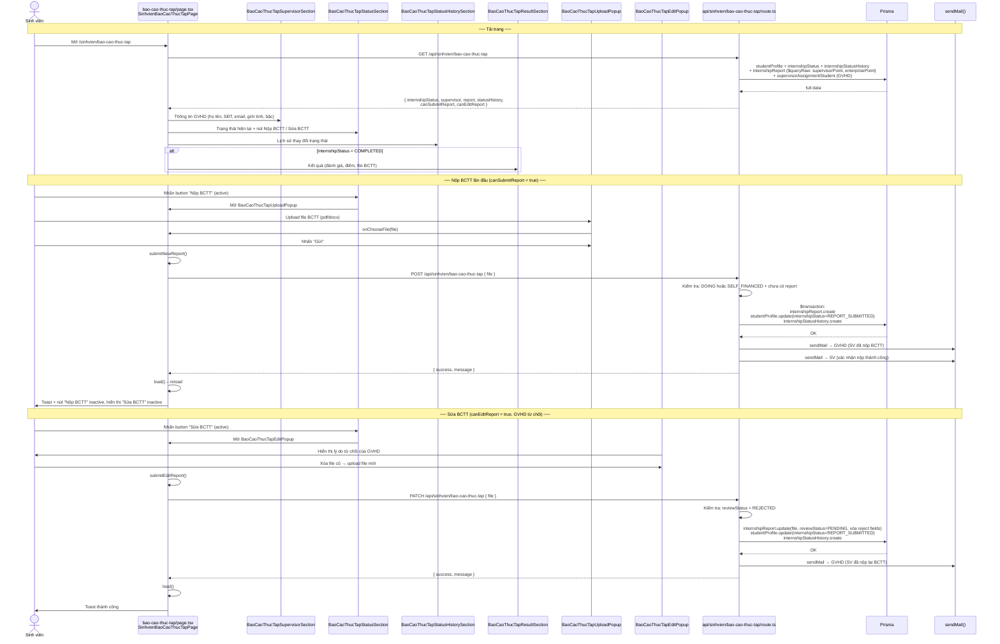
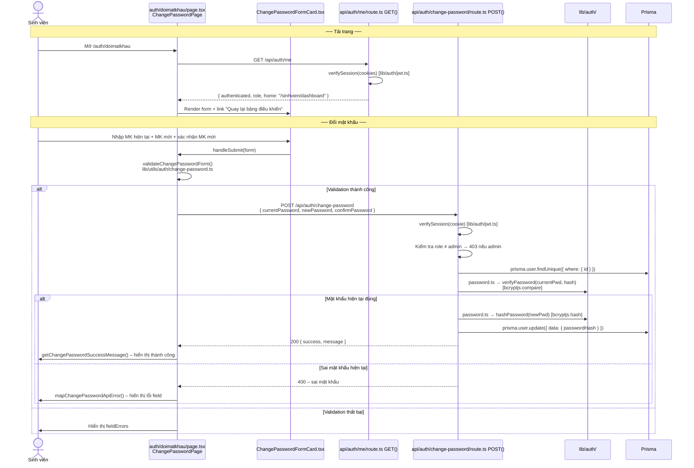
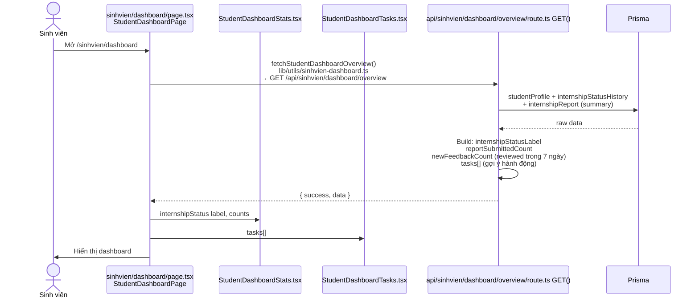
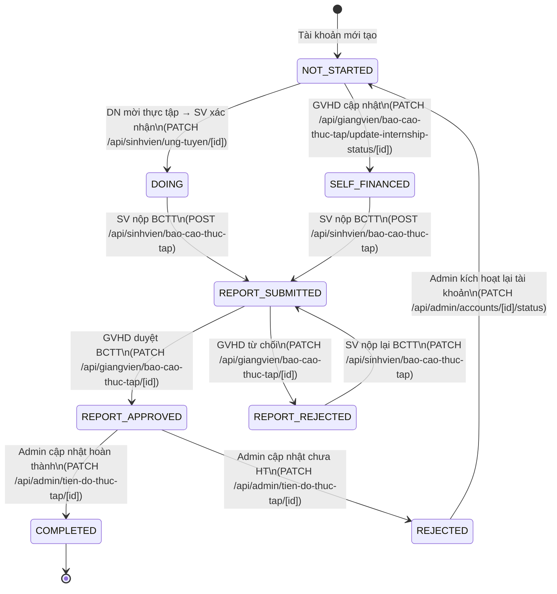

# Module Sinh viên

---

## Bảng tổng quan

| Module | Route | API chính | Email |
|--------|-------|-----------|-------|
| Tài khoản | `/sinhvien/ho-so` | `/api/sinhvien/tai-khoan`, `/api/sinhvien/ho-so-sinh-vien` | Không |
| Tra cứu & ứng tuyển | `/sinhvien/tra-cuu-ung-tuyen` | `/api/sinhvien/tra-cuu-ung-tuyen` | Không |
| Quản lý đăng ký ứng tuyển | `/sinhvien/quan-ly-dang-ky-ung-tuyen` | `/api/sinhvien/ung-tuyen` | Có (DN + SV) |
| Tiến độ thực tập | `/sinhvien/bao-cao-thuc-tap` | `/api/sinhvien/bao-cao-thuc-tap` | Có (GVHD + SV) |
| Đổi mật khẩu | `/auth/doimatkhau` | `/api/auth/change-password` | Không |
| Dashboard | `/sinhvien/dashboard` | `/api/sinhvien/dashboard/overview` | Không |

### Ghi chú hiệu năng
- DashboardShell đã bỏ reload toàn trang sau mutation; trải nghiệm nộp/cập nhật dữ liệu phản hồi nhanh hơn.
- API tìm việc (`/api/sinhvien/tra-cuu-ung-tuyen`) giới hạn query ngắn: `contains` chỉ chạy khi `q.length >= 2`.

---

## Tech Stack & cấu trúc thư mục

```
app/
├── sinhvien/
│   ├── layout.tsx                          # SinhvienLayout – bọc DashboardShell role="sinhvien"
│   ├── dashboard/
│   │   ├── page.tsx                        # StudentDashboardPage
│   │   └── components/
│   │       ├── StudentDashboardStats.tsx   # StudentDashboardStats
│   │       └── StudentDashboardTasks.tsx   # StudentDashboardTasks
│   ├── ho-so/
│   │   ├── page.tsx                        # SinhVienHoSoPage
│   │   └── components/
│   │       ├── SinhVienAccountInfo.tsx     # Thông tin tài khoản (read-only)
│   │       ├── SinhVienSupervisorInfo.tsx  # Thông tin GVHD
│   │       └── SinhVienProfileEditSection.tsx # Chỉnh sửa hồ sơ
│   ├── tra-cuu-ung-tuyen/
│   │   ├── page.tsx                        # SinhVienTraCuuUngTuyenPage
│   │   ├── components/
│   │   │   ├── TraCuuUngTuyenToolbar.tsx
│   │   │   └── TraCuuUngTuyenJobGrid.tsx
│   │   └── [id]/
│   │       ├── page.tsx                    # SinhVienJobDetailPage
│   │       └── components/
│   │           ├── JobDetailInfo.tsx
│   │           └── ApplyFormPopup.tsx
│   ├── quan-ly-dang-ky-ung-tuyen/
│   │   ├── page.tsx                        # SinhVienQuanLyUngTuyenPage
│   │   └── components/
│   │       ├── QuanLyUngTuyenToolbar.tsx
│   │       └── QuanLyUngTuyenTableSection.tsx (+ inner ActionCell)
│   └── bao-cao-thuc-tap/
│       ├── page.tsx                        # SinhvienBaoCaoThucTapPage
│       └── components/
│           ├── BaoCaoThucTapStatusSection.tsx
│           ├── BaoCaoThucTapSupervisorSection.tsx
│           ├── BaoCaoThucTapStatusHistorySection.tsx
│           ├── BaoCaoThucTapResultSection.tsx
│           ├── BaoCaoThucTapUploadPopup.tsx
│           └── BaoCaoThucTapEditPopup.tsx
│
├── auth/doimatkhau/
│   ├── page.tsx                            # ChangePasswordPage
│   └── components/ChangePasswordFormCard.tsx
│
└── api/sinhvien/
    ├── tai-khoan/route.ts                  # GET
    ├── ho-so-sinh-vien/route.ts            # GET, PATCH
    ├── tra-cuu-ung-tuyen/route.ts          # GET
    ├── tra-cuu-ung-tuyen/[id]/route.ts     # GET
    ├── tra-cuu-ung-tuyen/[id]/apply/route.ts # POST
    ├── ung-tuyen/route.ts                  # GET
    ├── ung-tuyen/[id]/route.ts             # PATCH
    ├── bao-cao-thuc-tap/route.ts           # GET, POST, PATCH
    └── dashboard/overview/route.ts         # GET

lib/
├── constants/
│   ├── sinhvien.ts                         # SINHVIEN_DASHBOARD_NAV, nav routes
│   ├── sinhvien-ho-so.ts                   # endpoints, PHONE_PATTERN, CV_ALLOWED_MIMES
│   ├── sinhvien-tra-cuu-ung-tuyen.ts       # list endpoint, status labels
│   ├── sinhvien-tra-cuu-ung-tuyen-detail.ts# detail path, validation strings
│   ├── sinhvien-quan-ly-dang-ky-ung-tuyen.ts # endpoint, labels, button texts
│   ├── sinhvien-bao-cao-thuc-tap.ts        # endpoint, BCTT_ALLOWED_MIMES, status labels
│   └── sinhvien-dashboard.ts              # SINHVIEN_DASHBOARD_OVERVIEW_ENDPOINT
├── types/
│   ├── sinhvien-ho-so.ts                   # StudentAccount, SupervisorInfo, SinhVienHoSoProfile...
│   ├── sinhvien-ho-so-shared.ts            # StudentDegree, Gender, SupervisorDegree
│   ├── sinhvien-tra-cuu-ung-tuyen.ts       # SinhVienTraCuuUngTuyenItem, WorkType, InternshipStatus
│   ├── sinhvien-tra-cuu-ung-tuyen-detail.ts# SinhVienTraCuuUngTuyenJobDetail, SinhVienApplyProfile
│   ├── sinhvien-quan-ly-dang-ky-ung-tuyen.ts # SinhVienQuanLyDangKyUngTuyenRow, AppStatus...
│   ├── sinhvien-bao-cao-thuc-tap.ts        # InternshipStatus, Report, StatusHistoryEvent...
│   └── sinhvien-dashboard.ts              # StudentDashboardItem, StudentDashboardOverviewResponse
└── utils/
    ├── sinhvien-ho-so.ts                   # buildSinhVienHoSoPatchPayload, validateSinhVienHoSoDraft...
    ├── sinhvien-tra-cuu-ung-tuyen.ts       # buildSinhVienTraCuuUngTuyenListUrl, fetchList...
    ├── sinhvien-tra-cuu-ung-tuyen-detail.ts# fetchDetail, validateApplyDraft, buildApplyPayload...
    ├── sinhvien-quan-ly-dang-ky-ung-tuyen.ts # buildListUrl, buildRespondEndpoint, canRespond...
    ├── sinhvien-bao-cao-thuc-tap.ts        # helpers cho BCTT page
    └── sinhvien-dashboard.ts              # fetchStudentDashboardOverview, getErrorMessage...
```

---

## 1. Tài khoản (`/sinhvien/ho-so`)

### Chức năng
- Xem thông tin tài khoản (MSV, lớp, khoa, khóa, bậc) — **read-only**
- Xem thông tin GVHD được phân công (hoặc "Chưa được phân công")
- Xem & chỉnh sửa hồ sơ cá nhân: SĐT, email, địa chỉ thường trú, thư giới thiệu, CV

### Sơ đồ luồng



### API chi tiết

| Route | Method | Prisma | Trả về |
|-------|--------|--------|--------|
| `/api/sinhvien/tai-khoan` | GET | `studentProfile.findFirst` + `supervisorAssignmentStudent.findFirst` | `{ student, supervisor \| null }` |
| `/api/sinhvien/ho-so-sinh-vien` | GET | `studentProfile.findFirst` + `user` | `{ item: profile }` |
| `/api/sinhvien/ho-so-sinh-vien` | PATCH | `$transaction`: `user.update` + `studentProfile.update` | `{ success, message }` hoặc `{ errors }` |

---

## 2. Tra cứu & ứng tuyển (`/sinhvien/tra-cuu-ung-tuyen`)

### Chức năng
- Xem danh sách tin tuyển dụng đang hoạt động (lọc theo từ khóa, loại công việc, địa điểm Tỉnh/Thành)
- Xem chi tiết tin tuyển dụng
- Nộp hồ sơ ứng tuyển (chỉ khi `internshipStatus = NOT_STARTED`)

### Điều kiện nộp hồ sơ
- Sinh viên phải có `internshipStatus = "NOT_STARTED"` (Chưa thực tập)
- Tin tuyển dụng phải còn trong hạn (`deadline ≥ now`) và trạng thái `ACTIVE`
- Doanh nghiệp phải có `enterpriseStatus = APPROVED`
- Mỗi SV chỉ nộp 1 hồ sơ / 1 tin

### Sơ đồ luồng



### API chi tiết

| Route | Method | Điều kiện | Prisma | Email |
|-------|--------|-----------|--------|-------|
| `/api/sinhvien/tra-cuu-ung-tuyen` | GET | — | `jobPost.findMany` (ACTIVE + deadline + enterprise APPROVED) + `studentProfile` + `jobApplication` | Không |
| `/api/sinhvien/tra-cuu-ung-tuyen/[id]` | GET | — | `jobPost` + `studentProfile` + `jobApplication` | Không |
| `/api/sinhvien/tra-cuu-ung-tuyen/[id]/apply` | POST | `internshipStatus = NOT_STARTED`, không trùng, job còn hạn | `$transaction`: `user.update` + `studentProfile.update` + `jobApplication.create` | Không |

---

## 3. Quản lý đăng ký ứng tuyển (`/sinhvien/quan-ly-dang-ky-ung-tuyen`)

### Chức năng
- Xem danh sách hồ sơ đã nộp kèm trạng thái
- Lọc theo trạng thái (`Chờ xem xét`, `Mời phỏng vấn`, `Trúng tuyển`, `Từ chối`)
- Xem chi tiết lời mời phỏng vấn / trúng tuyển (popup) từ cột **Thao tác**
- Phản hồi lời mời phỏng vấn / thực tập (Xác nhận / Từ chối) từ cột **Thao tác**
- Sau khi phản hồi: cả 2 nút đều bị vô hiệu hoá (1 lần duy nhất)

### Trạng thái & luồng phản hồi

```
Trạng thái ứng tuyển (AppStatus)      Trạng thái phản hồi (ResponseStatus)
─────────────────────────────────────  ───────────────────────────────────────
PENDING      → Chờ xem xét            (chưa có)
INTERVIEW_INVITED → Mời phỏng vấn  →  SV phản hồi: CONFIRM_INTERVIEW / DECLINE_INTERVIEW
OFFERED      → Trúng tuyển         →  SV phản hồi: CONFIRM_INTERNSHIP / DECLINE_INTERNSHIP
REJECTED     → Từ chối                (không phản hồi)
STUDENT_DECLINED → Từ chối (SV)       (đã phản hồi)
```

### Sơ đồ luồng



### API chi tiết

| Route | Method | Body | Prisma | Email |
|-------|--------|------|--------|-------|
| `/api/sinhvien/ung-tuyen` | GET | `?status=` | `jobApplication.findMany` + `jobPost` + enterprise + `history` (lấy `interviewLocation/responseDeadline` từ `history`) | Không |
| `/api/sinhvien/ung-tuyen/[id]` | PATCH | `{ action }` | `jobApplication.update` + (nếu CONFIRM_INTERNSHIP) `$transaction` cập nhật `internshipStatus=DOING` + `internshipStatusHistory.create` | Có: DN + SV |

### Email gửi đi khi phản hồi

| Sự kiện | Người nhận | Nội dung |
|---------|-----------|---------|
| `CONFIRM_INTERVIEW` | DN | SV xác nhận tham gia phỏng vấn |
| `DECLINE_INTERVIEW` | DN | SV từ chối phỏng vấn |
| `CONFIRM_INTERNSHIP` | DN | SV xác nhận thực tập (kèm cập nhật `internshipStatus=DOING`) |
| `DECLINE_INTERNSHIP` | DN | SV từ chối thực tập |
| Tất cả | SV | Email xác nhận bản sao hành động |

---

## 4. Quản lý tiến độ thực tập (`/sinhvien/bao-cao-thuc-tap`)

### Chức năng
- Xem thông tin GVHD (nếu đã được phân công)
- Theo dõi trạng thái thực tập hiện tại & lịch sử thay đổi
- Nộp BCTT (chỉ active khi `internshipStatus = DOING` hoặc `SELF_FINANCED`)
- Sửa BCTT (chỉ active khi GVHD từ chối — `reviewStatus = REJECTED`)
- Xem kết quả thực tập khi `internshipStatus = COMPLETED` (đánh giá, điểm, file BCTT)

### Trạng thái & điều kiện

```
internshipStatus          canSubmitReport    canEditReport
──────────────────────    ───────────────    ─────────────
NOT_STARTED               false              false
DOING                     true (nếu chưa nộp)  false
SELF_FINANCED             true (nếu chưa nộp)  false
REPORT_SUBMITTED          false              false (đang chờ duyệt)
REPORT_REJECTED           false              true  (GVHD từ chối)
REPORT_APPROVED           false              false
COMPLETED                 false              false  → hiển thị kết quả
REJECTED (Chưa HT)        false              false
```

### Sơ đồ luồng



### API chi tiết

| Route | Method | Điều kiện | Prisma | Email |
|-------|--------|-----------|--------|-------|
| `/api/sinhvien/bao-cao-thuc-tap` | GET | SV đã login | `studentProfile` + `internshipStatusHistory` + `internshipReport` ($queryRaw) + supervisor | Không |
| `/api/sinhvien/bao-cao-thuc-tap` | POST | `DOING` hoặc `SELF_FINANCED`, chưa có report | `$transaction`: `internshipReport.create` + `studentProfile.update(REPORT_SUBMITTED)` + `internshipStatusHistory.create` | GVHD + SV |
| `/api/sinhvien/bao-cao-thuc-tap` | PATCH | `reviewStatus = REJECTED` | `internshipReport.update` + `studentProfile.update(REPORT_SUBMITTED)` + `internshipStatusHistory.create` | GVHD |

### Email gửi đi

| Sự kiện | Người nhận | Nội dung |
|---------|-----------|---------|
| SV nộp BCTT lần đầu (POST) | GVHD | Thông báo SV đã nộp BCTT, yêu cầu duyệt |
| SV nộp BCTT lần đầu (POST) | SV | Xác nhận nộp thành công |
| SV nộp lại BCTT sau từ chối (PATCH) | GVHD | Thông báo SV đã nộp lại BCTT |

---

## 5. Đổi mật khẩu (`/auth/doimatkhau`)

### Chức năng
- Đổi mật khẩu khi đã đăng nhập
- Yêu cầu nhập mật khẩu hiện tại để xác thực
- Admin bị chặn (trả 403)

### Sơ đồ luồng



### API chi tiết

| Route | Method | Prisma | Email |
|-------|--------|--------|-------|
| `/api/auth/me` | GET | Không (chỉ verify JWT cookie) | Không |
| `/api/auth/change-password` | POST | `user.findUnique` + `user.update` | Không |

---

## 6. Dashboard (`/sinhvien/dashboard`)

### Chức năng
- Hiển thị tổng quan: trạng thái thực tập, số BCTT đã nộp, phản hồi mới từ GVHD
- Hiển thị danh sách task gợi ý hành động tiếp theo

### Sơ đồ luồng



### API chi tiết

| Route | Method | Prisma | Trả về |
|-------|--------|--------|--------|
| `/api/sinhvien/dashboard/overview` | GET | `studentProfile` + `internshipStatusHistory` + `internshipReport` | `{ internshipStatus, reportSubmittedCount, newFeedbackCount, tasks[] }` |

---

## Tổng hợp luồng trạng thái thực tập của Sinh viên



---

## Tổng hợp API toàn module

| API Route | Method | Auth | Email | Ghi chú |
|-----------|--------|------|-------|---------|
| `/api/sinhvien/tai-khoan` | GET | sinhvien | — | Thông tin tài khoản + GVHD |
| `/api/sinhvien/ho-so-sinh-vien` | GET | sinhvien | — | Profile có thể chỉnh sửa |
| `/api/sinhvien/ho-so-sinh-vien` | PATCH | sinhvien | — | Cập nhật profile + CV |
| `/api/sinhvien/tra-cuu-ung-tuyen` | GET | sinhvien | — | Danh sách tin tuyển dụng |
| `/api/sinhvien/tra-cuu-ung-tuyen/[id]` | GET | sinhvien | — | Chi tiết tin |
| `/api/sinhvien/tra-cuu-ung-tuyen/[id]/apply` | POST | sinhvien | — | Nộp hồ sơ ứng tuyển |
| `/api/sinhvien/ung-tuyen` | GET | sinhvien | — | Danh sách hồ sơ đã nộp |
| `/api/sinhvien/ung-tuyen/[id]` | PATCH | sinhvien | Có | Phản hồi lời mời phỏng vấn/thực tập |
| `/api/sinhvien/bao-cao-thuc-tap` | GET | sinhvien | — | Trạng thái + BCTT + GVHD |
| `/api/sinhvien/bao-cao-thuc-tap` | POST | sinhvien | Có | Nộp BCTT lần đầu |
| `/api/sinhvien/bao-cao-thuc-tap` | PATCH | sinhvien | Có | Nộp lại BCTT sau từ chối |
| `/api/sinhvien/dashboard/overview` | GET | sinhvien | — | Tổng quan dashboard |
| `/api/auth/me` | GET | cookie | — | Lấy role + home URL |
| `/api/auth/change-password` | POST | cookie | — | Đổi mật khẩu |
